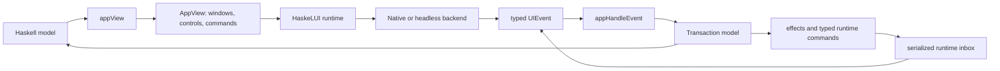

# HaskeLUI User Guide

Status: implemented vertical-slice API

Toolchain: Stack, GHC 9.10.3

Current native backend: macOS AppKit

HaskeLUI is an experimental framework for writing native desktop applications in
Haskell. Application code owns ordinary immutable Haskell state and describes
windows, workspaces, controls, commands, and layout without importing a native
UI toolkit. A backend retains and updates the corresponding native objects.

This guide documents the API that exists and compiles in this repository. It
does not present types from design sketches or `spikes/` as finished features.
The pure lens-based `Property` and `Binding` layers and the generic
external-event/task/service/subscription runtime are implemented. The
validation-specific asynchronous control layer and Windows backend are not yet
implemented.

## Contents

1. [The programming model](#1-the-programming-model)
2. [Run a first application](#2-run-a-first-application)
3. [State, events, and transactions](#3-state-events-and-transactions)
   - [External events, tasks, services, and subscriptions](#external-events-tasks-services-and-subscriptions)
4. [Identity and reconciliation](#4-identity-and-reconciliation)
5. [Windows and real desktop workspaces](#5-windows-and-real-desktop-workspaces)
6. [Commands](#6-commands)
7. [Controls](#7-controls)
8. [Portable layout](#8-portable-layout)
9. [Collections, trees, and tables](#9-collections-trees-and-tables)
10. [Text, rich text, and presentation layers](#10-text-rich-text-and-presentation-layers)
11. [Dialogs, popovers, and feedback](#11-dialogs-popovers-and-feedback)
12. [Effects and file workflows](#12-effects-and-file-workflows)
13. [Structuring a real application](#13-structuring-a-real-application)
14. [Validation and testing](#14-validation-and-testing)
15. [Current boundaries](#15-current-boundaries)
16. [Examples and deeper references](#16-examples-and-deeper-references)

## 1. The programming model

Every HaskeLUI application is an `App model`:

```haskell
data App model = App
  { appInitialModel :: model
  , appInitialEffects :: [Effect]
  , appInitialCommands :: [RuntimeCommand model]
  , appServices :: [Service model]
  , appSubscriptions :: model -> [Subscription model]
  , appView         :: model -> AppView
  , appHandleEvent  :: UIEvent -> model -> Transaction model
  }
```

The model is authoritative. `appView` is a pure projection of that model, and
`appHandleEvent` is a pure reducer that describes the next model transition.
Application code does not mutate native controls directly.



The runtime performs the cycle:

1. Render the initial model.
2. Start static services, desired subscriptions, initial runtime commands, and
   compatibility effects.
3. Enqueue native and external callbacks in one serialized inbox.
4. Apply a bounded batch of accepted transactions in order; every callback
   sees the current model.
5. Reconcile the final desired window/control tree once on the backend UI
   thread.
6. Interpret compatibility effects after reconciliation and enqueue their
   completions normally.

This architecture keeps application behavior deterministic and makes most of
the program testable without AppKit.

### The important layers

| Layer | Main types | Responsibility |
|---|---|---|
| Application | your `model` | Documents, selection, dirty state, visibility, domain rules |
| State transition | `UIEvent`, `ExternalEvent model`, `Transaction model` | Pure current-model handling and declared work |
| Surface | `AppView`, `WindowSpec`, `Control` | Desired semantic UI |
| Layout | `Layout ElementKey`, `LayoutContainerSpec` | Pure sizing and placement |
| Runtime | `runApp`, `RuntimeCommand`, `Backend` | Serialized inbox, tasks, services, subscriptions, reconciliation |
| Backend | AppKit or headless | Native peers, measurement, focus, accessibility, disposal |

## 2. Run a first application

Applications normally depend on `haskelui-core`, `haskelui-runtime`, and one backend. A
macOS executable in this workspace uses:

```yaml
dependencies:
  - base >= 4.20.2 && < 4.21
  - text
  - haskelui-core
  - haskelui-runtime
  - haskelui-backend-appkit
```

Here is a complete small application:

```haskell
{-# LANGUAGE DerivingStrategies #-}
{-# LANGUAGE OverloadedRecordDot #-}
{-# LANGUAGE OverloadedStrings #-}

module Main (main) where

import Data.Text (Text)
import HaskeLUI.Backend.AppKit (appKitBackend)
import HaskeLUI.Core
import HaskeLUI.Runtime (runApp)

data Model = Model
  { name :: !Text
  , saved :: !Bool
  , windowOpen :: !Bool
  }
  deriving stock (Eq, Show)

helloWindowKey :: WindowKey
helloWindowKey = WindowKey 1

nameKey :: ElementKey
nameKey = ElementKey 10

saveCommand :: CommandId
saveCommand = CommandId 1

application :: App Model
application =
  simpleApp (Model "Haskell" False True) view update

view :: Model -> AppView
view model =
  AppView
    { appWindows =
        [ WindowSpec
            { windowKey = helloWindowKey
            , windowTitle = if model.saved then "Hello — Saved" else "Hello"
            , windowFrame = Rect 120 160 480 240
            , windowControls =
                [ Label (ElementKey 11) (Rect 24 176 420 24) ("Hello, " <> model.name)
                , TextField nameKey (Rect 24 126 300 28) model.name "Your name" False
                , Button (ElementKey 12) (Rect 24 70 120 32) "Save" saveCommand (not model.saved)
                ]
            }
        | model.windowOpen
        ]
    , appCommands =
        [CommandSpec saveCommand "Save" (Just "s") (not model.saved)]
    }

update :: UIEvent -> Model -> Transaction Model
update event model =
  case event of
    TextChanged key value
      | key == nameKey ->
          transaction "Edit name" (Coalesce (UndoGroup "name")) $ \current ->
            current {name = value, saved = False}
    CommandInvoked command
      | command == saveCommand ->
          transaction "Save" NoUndo $ \current -> current {saved = True}
    WindowCloseRequested key
      | key == helloWindowKey ->
          transaction "Close window" NoUndo $ \current -> current {windowOpen = False}
    _ -> noTransaction

main :: IO ()
main = runApp appKitBackend application
```

The same source is available as [docs/examples/Hello.hs](examples/Hello.hs).

Notice three properties of this program:

- The text field does not own the name. It displays `model.name` and publishes
  `TextChanged` events.
- The menu shortcut and button share one `CommandId` and therefore one action.
- A close request does not destroy the window automatically. The reducer
  removes the window from the desired `appWindows` list by changing the model.

The examples in this repository can be run with:

```console
stack exec haskelui-appkit-vertical
stack exec vh
stack exec haskelui-control-gallery
```

## 3. State, events, and transactions

### Events are typed and normalized

Backends translate native callbacks into the closed `UIEvent` vocabulary. The
important groups are:

| Event family | Events |
|---|---|
| Commands and activation | `CommandInvoked`, `ControlInvoked` |
| Editing | `TextChanged`, `ToggleChanged`, `ChoiceChanged`, `NumberChanged` |
| Structured values | `DateChanged`, `TimeChanged`, `ColorChanged` |
| Collections | `CollectionSelectionChanged`, `CollectionExpansionChanged` |
| Containers and presentations | `DisclosureChanged`, `PresentationClosed` |
| Desktop shell | `TabSelected`, `TabCloseRequested`, `PaneStateChanged`, `WindowCloseRequested`, `WindowActivated` |
| Files and folders | `TextFileChosen`, `ProjectFolderChosen`, `DirectoryRead`, `TextFileRead`, `TextFileWritten` |

Control events carry stable identities, not native pointers or transient row
indexes. Reducers should first match the event constructor and then its key.

### Transactions describe atomic model changes

Use `transaction` for a pure transition:

```haskell
transaction
  "Toggle inspector"
  NoUndo
  (\model -> model {inspectorVisible = not model.inspectorVisible})
```

Use `transactionWithEffects` when a committed state transition also starts one
or more supported effects:

```haskell
transactionWithEffects
  "Save document"
  NoUndo
  [WriteTextFile effectKey path contents]
  (\model -> model {status = "Saving…"})
```

When the transition is already an inspectable property action, use
`transactionFromActionWithEffects` instead. This preserves touched-property
metadata alongside the effect:

```haskell
transactionFromActionWithEffects
  "Save document"
  NoUndo
  [WriteTextFile effectKey path contents]
  (properties.document.status .= "Saving…")
```

Use `requestEffect` when no immediate model change is required:

```haskell
requestEffect "Choose files" RequestOpenTextFiles
```

Return `noTransaction` for an event the feature does not handle.

### Undo policy

The current transaction envelope supports:

- `NoUndo`
- `UndoEveryEdit`
- `Coalesce (UndoGroup name)`
- `SingleUndo (UndoGroup name)`

These values record the intended undo semantics. The current runtime applies
transactions but does not yet maintain a complete application-level undo
history. Native text controls still retain their native editing behavior; do
not treat the transaction metadata as a finished cross-control undo manager.

### Keep effects out of reducers

`appHandleEvent` is pure. Do not call file, network, timer, or native APIs from
it. The older closed `Effect` algebra remains for native file panels and the
existing editor workflow. New finite/background work should use typed runtime
commands, and long-lived infrastructure should use services or subscriptions.
All three keep `IO` visible at declaration sites while reducers still return
ordinary pure values.

### External events, tasks, services, and subscriptions

Import the focused modules instead of treating asynchronous work as part of
the control vocabulary:

```haskell
import HaskeLUI.ExternalEvent
import HaskeLUI.Service
import HaskeLUI.Task
```

The runtime uses four deliberately different abstractions:

| Abstraction | Lifetime | Input/output shape | Typical use |
|---|---|---|---|
| `ExternalEvent model` | one delivery | current model to `Transaction model` | completion or stream item |
| task command | finite | one `IO result`, one `TaskOutcome result` | read, save, query, computation |
| `Service model` | application | typed command stream, many external events | compiler worker, process, database connection |
| `Subscription model` | while declared by the model | many external events, no command endpoint | watcher, timer, application lifecycle stream |

They are not aliases for the same generic effect. The distinctions give the
runtime enough information to own cancellation, replacement, restart,
backpressure, and teardown correctly.

#### External events use the current model

An external event stores a description and a pure callback:

```haskell
externalEvent "Document read completed" $ \currentModel ->
  acceptDocumentRead requestedRevision result currentModel
```

The callback is run only after the event reaches the serialized UI-thread
inbox. It receives the model at that time, not a snapshot retained when the
work started. Keep domain evidence such as document identity, requested text
revision, or protocol request ID in the closure and check it before accepting
the result.

For replaceable progress or snapshots, make coalescing explicit:

```haskell
latestExternalEvent
  (EventCoalescingKey "analysis:Main.hs")
  "Newest Main.hs analysis snapshot"
  acceptAnalysisSnapshot
```

`DeliverEvery` is lossless. `KeepLatest key` retains only the newest still
pending event for that key. Never coalesce terminal results that callers must
observe.

#### Finite tasks

Start finite work from a transaction:

```haskell
loadDocument :: FilePath -> TextRevision -> RuntimeCommand EditorModel
loadDocument path requestedRevision =
  startTaskWith
    (TaskKey ("document.read:" <> Text.pack path))
    ( (defaultTaskOptions (LifetimeScope (LifetimeKey "document:1")) ReplaceRunning)
        { taskTimeoutMilliseconds = Just 10000
        }
    )
    "Read UTF-8 document"
    (\cancel -> do
      throwIfCancelled cancel
      readDocumentUtf8 path
    )
    (\outcome ->
      externalEvent "Document read finished" $ \model ->
        handleDocumentRead path requestedRevision outcome model
    )
```

Attach it to an immediate model update with `transactionWithCommands`, or to
an existing transaction with `appendRuntimeCommands`:

```haskell
transactionWithCommands
  "Begin document load"
  NoUndo
  [loadDocument path revision]
  (\model -> model {status = "Loading…"})
```

Task start policies are semantic:

- `ReplaceRunning` invalidates and requests cancellation of the old generation.
- `KeepRunning` ignores a duplicate while the key is active.
- `RequireIdle` also refuses a duplicate and is intended for operations whose
  overlap indicates a programming error.

Parallel work uses different `TaskKey` values. Every completion is checked
against its key, runtime generation, owner scope, and shutdown state before its
callback runs. Cancellation is cooperative optimization; these checks provide
correctness even when old `IO` races or catches cancellation.

`TaskOutcome result` separates executor failure from domain failure:

- `TaskSucceeded result`
- `TaskCancelled`
- `TaskFailed TaskTimedOut`
- `TaskFailed (TaskException summary)`
- `TaskFailed TaskExecutorStopped`

Return expected domain failure as data, commonly `Either DomainError value`,
inside `TaskSucceeded`. Open exceptions are converted to retainable text and
are never placed directly in the application model.

Task scopes are `ApplicationScope`, `WindowScope`, `ElementScope`, and
`LifetimeScope`. Window and element liveness is derived automatically from the
latest desired `AppView`. Custom lifetimes are explicit and can bracket a
document or workspace:

```haskell
transactionWithCommands
  "Open document lifetime"
  NoUndo
  [openLifetime documentLifetime, loadDocument path revision]
  insertDocument

transactionWithCommands
  "Close document lifetime"
  NoUndo
  [closeLifetime documentLifetime]
  removeDocument
```

Closing a lifetime or removing an owning window/element invalidates all later
completion events before it requests cancellation.

#### Typed, supervised services

`service` returns both an application-lifetime specification and the only
correctly typed endpoint for its commands:

```haskell
data AnalysisCommand
  = AnalyzeDocument DocumentKey TextRevision Text
  | ForgetDocument DocumentKey

(analysisService, analysisEndpoint) =
  serviceWithStatus
    (ServiceKey "visual-haskell.analysis")
    "Visual Haskell GHC worker"
    ( defaultServiceOptions
        { serviceCommandCapacity = 64
        , serviceOverflowPolicy =
            ReplacePendingCommand analysisDocumentKey
        }
    )
    analysisStatusEvent
    runAnalysisService
```

The implementation receives a `ServiceContext`:

```haskell
runAnalysisService context = loop
  where
    loop = do
      next <- context.receiveCommand
      case next of
        Nothing -> pure ()
        Just command -> do
          result <- analyze command
          emitExternalEvent context.serviceEvents (analysisResultEvent result)
          loop
```

`receiveCommand` returns `Nothing` during cancellation. The context also
contains the cancellation token, `reportServiceHealth`, and an
`ExternalSink`. Use `emitLatest` on that sink only for explicitly replaceable
progress/snapshot events.

Send typed commands from transactions:

```haskell
transactionWithCommands
  "Request analysis"
  NoUndo
  [sendService analysisEndpoint (AnalyzeDocument key revision contents)]
  markAnalysisPending
```

`sendServiceWithResult` additionally returns `ServiceSendResult` through an
external event when the UI must surface `ServiceUnavailable`, queue rejection,
coalescing, oldest-command replacement, or an impossible-in-well-formed-code
`ServiceEndpointMismatch`. The default endpoint never blocks the UI thread.

Service queues are bounded. Choose one policy:

- `RejectNewCommand`
- `DropOldestCommand`
- `ReplacePendingCommand commandCoalescingKey`

The default supervisor uses bounded exponential backoff with deterministic
per-service jitter. `serviceWithStatus` can expose starting, running, health,
exit, scheduled-restart, and circuit-open states in the application model.
`restartService` provides an explicit Retry action. Runtime generations reject
events emitted by a process or thread belonging to an older service instance.

Declare services on the application:

```haskell
application =
  (simpleApp initialModel view update)
    { appServices = [analysisService]
    , appInitialCommands = [sendService analysisEndpoint Initialize]
    }
```

#### Declarative subscriptions

A subscription is keyed and fingerprinted desired state:

```haskell
workspaceWatch root =
  subscription
    (SubscriptionKey "workspace.files")
    (SubscriptionFingerprint (Text.pack root))
    (\events -> startWorkspaceWatcher root events)

subscriptions model =
  maybe [] (pure . workspaceWatch) model.projectRoot
```

`startWorkspaceWatcher` returns an `IO ()` stop action. The runtime diffs
`appSubscriptions model` after every accepted transaction:

- same key and fingerprint: retain;
- same key and a new fingerprint: stop/restart with a new generation;
- removed key: stop and reject all later old-generation events;
- new key: start it outside application callbacks.

Subscriptions are for model-selected external streams. A compiler worker that
accepts commands is a service; a single directory read is a task.

#### Ordering and thread guarantees

Native `UIEvent` values and every external event enter one lossless serialized
inbox. A bounded drain applies callbacks in FIFO order, recomputes ownership
between events, and reconciles only the final desired view for the batch.
Tasks/services/subscriptions never receive the model reference or backend
objects. Reducers, external callbacks, `appView`, layout, and native rendering
all execute on the backend UI thread.

`runApp` uses `defaultRuntimeOptions`, currently a maximum of 128 envelopes per
batch. Tests or specialized applications can call `runAppWith` and set
`runtimeMaximumBatchSize`; nonpositive values are safely clamped to one.
`runtimeShutdownGraceMilliseconds` bounds how long shutdown waits for
cooperative task, service, subscription, and restart-timer cancellation before
releasing the backend (two seconds by default). Late events remain invalid even
if arbitrary uninterruptible `IO` outlives that grace period.

The AppKit backend schedules drains on its main dispatch queue. Other native
backends must provide the equivalent dispatcher through
`backendScheduleOnUI`. Shutdown invalidates producers before native resources
are released, so a late completion cannot update the model or call a disposed
backend.

### Named model properties

HaskeLUI's property API is lens-backed, but ordinary application code does not need
to learn lens operators. Derive `Generic`, define one root, and use checked
record-dot paths:

```haskell
{-# LANGUAGE DeriveGeneric #-}
{-# LANGUAGE DerivingStrategies #-}
{-# LANGUAGE OverloadedRecordDot #-}

import GHC.Generics (Generic)
import HaskeLUI.Property

data Document = Document
  { title :: !Text
  , dirty :: !Bool
  }
  deriving stock (Eq, Generic, Show)

data Settings = Settings
  { fontSize :: !Int
  }
  deriving stock (Eq, Generic, Show)

data Model = Model
  { document :: !Document
  , settings :: !Settings
  , status :: !Text
  }
  deriving stock (Eq, Generic, Show)

properties :: Path Model Model
properties = rootPath
```

The small everyday vocabulary is:

```haskell
get properties.document.title model

properties.document.title .= "New title"  -- Action Model

modify properties.document.dirty not      -- Action Model
```

The path is statically checked and carries the derived identity
`PropertyId "document.title"`. Assignment and modification create pure
`Action` values. They do not mutate the model.

Use `batchActions` for one atomic multi-property update and
`transactionFromAction` at a reducer boundary:

```haskell
transactionFromAction
  "Save"
  NoUndo
  ( batchActions
      "Save"
      [ properties.document.dirty .= False
      , properties.status .= "Saved"
      ]
  )
```

`actionPropertyIds` exposes all touched properties for diagnostics and the
future undo interpreter. `actionDescription` supplies a readable description.

For existing or handwritten lenses, wrap the compatible lens explicitly:

```haskell
documentTitle :: Property Model Text
documentTitle =
  fromLens (PropertyId "document.title") (#document . #title)
```

This explicit form needs `OverloadedLabels`. HaskeLUI uses a minimal van Laarhoven
`Lens'`; applications may interoperate with `lens` or `generic-lens` without
making the full lens package part of the beginner API.

`Property` is always total. Use `OptionalProperty`, `getOptional`,
`setOptional`, and `modifyOptional` when a selected or keyed target may not
exist. Optional updates return `Either PropertyApplyError`; they deliberately
do not use `.=` because ordinary `Action` has no failure channel.

### Pure typed bindings

`Binding model control` describes how a control reads, parses, validates, and
commits a model value. A direct text binding can be concise:

```haskell
import HaskeLUI.Binding

titleBinding :: Binding Model Text
titleBinding =
  bindWith
    properties.document.title
    [ validateWith nonblank
    , alsoWrite (const (properties.document.dirty .= True))
    , commitPolicy Live
    , undoPolicy (Coalesce (UndoGroup "document-title"))
    , labelTransaction "Rename document"
    ]
```

Render its authoritative value with `readBinding` and interpret a control
event with `editBinding`:

```haskell
TextField titleKey frame (readBinding titleBinding model) "Title" True

case editBinding model InputChanged titleBinding newText of
  EditCommitted _ committed -> committed
  DraftStaged _              -> noTransaction
  DraftInvalid _ _           -> noTransaction
```

The committed transaction atomically changes the title and dirty flag, carries
both touched `PropertyId` values, and retains its undo and label metadata.
`validateWithModel` supports pure cross-field constraints that need the current
model. File, network, and service validation must remain in the separate future
asynchronous layer.

When model and control types differ, use a codec:

```haskell
fontSizeBinding :: Binding Model Text
fontSizeBinding =
  bindText
    properties.settings.fontSize
    (textCodec (Text.pack . show) parseInteger)
    [ validateWith inRange
    , commitPolicy OnEnterOrBlur
    ]
```

Invalid input remains an exact control draft instead of being forced into the
valid model type. The general `codec`/`bindWithCodec` pair also supports
non-text controls, such as binding an `Int` property to a `Double` slider.

The commit policies are `Live`, `OnEnter`, `OnBlur`, `OnEnterOrBlur`, and
`ExplicitApply`. The pure protocol implements all five. Current concrete
controls integrate `Live` bindings directly; retained invalid/staged drafts
and enter/blur/apply dispatch still need the edit-session runtime adapter.

Use `captureDraftBaseline` and `reconcileDraft` when authoritative state may
change during an edit. `RefreshIfPristine`, `PreserveLocalDraft`, and
`DetectConcurrentChange` make the replacement/conflict policy explicit.

See [Property and binding API](design/property-binding-api.md) for the complete
contract, codecs, controlled escape hatch, optional focus, reconciliation
table, and exact current runtime boundary.

### Bindings for dynamically keyed children

A value behind `Map key child` is not a total property of the parent: its key
may be absent by the time an action is interpreted. Do not disguise it as a
total lens.

Visual Haskell demonstrates the current explicit pattern:

1. Look up the document by its stable `DocumentKey` when handling the event.
2. Build a `controlledWith` binding from that document's current value.
3. Construct ordinary total child actions through `Path Document Document`.
4. Lift each child action through the original key using `Map.adjust`, qualify
   its touched IDs as `documents.<key>.<field>`, and safely no-op if missing.

This preserves callback ergonomics, atomic batching, undo metadata, and stale
key safety without claiming that a dynamic lookup is a lens. The eventual
keyed-child adapter can package this pattern after Core fixes the public
missing-key diagnostic and insertion policies.

## 4. Identity and reconciliation

HaskeLUI retains native objects by stable typed keys:

- `WindowKey` identifies a window.
- `ElementKey` identifies a control.
- `CommandId` identifies an application command.
- `DocumentKey`, `PaneKey`, `SplitKey`, `WorkspaceItemKey`, `TabGroupKey`, and
  `TabKey` identify desktop workspace concepts.
- `ChoiceKey` and `CollectionItemKey` identify values inside controls.
- `EffectKey` correlates asynchronous-looking completions with their owner.

Keys are part of behavior, not merely diagnostics.

### Key rules

1. Keep a key stable for the logical lifetime of its object.
2. Do not use a collection index as identity if items can move.
3. Do not reuse a removed key immediately for a different logical object.
4. Keep `ElementKey` values unique across the flattened contents of one window,
   including nested containers and tabs.
5. Preserve the constructor associated with a retained key. Changing a key
   from a text field into a table requires replacing its native peer.

For dynamic data, derive UI keys from stable domain identities or allocate them
once when the domain object is created. A `Map DocumentKey Document` plus an
explicit tab-order list is preferable to using list positions as document IDs.

Stable identity lets reconciliation update text, selection, frames, and enabled
state without losing native focus, caret position, scroll state, or popover
anchors.

## 5. Windows and real desktop workspaces

### Ordinary windows

Use `WindowSpec` for a simple independent window:

```haskell
WindowSpec
  { windowKey = WindowKey 1
  , windowTitle = "Inspector"
  , windowFrame = Rect 700 200 360 480
  , windowControls = inspectorControls model
  }
```

Multiple windows are simply multiple values in `appWindows`. Adding or removing
them from the rendered list creates or closes their native peers.

`WindowCloseRequested` is a request. The reducer may accept it, reject it, show
feedback, or start a save flow. This is how dirty-document close negotiation is
implemented.

### Workspace windows

Use `WorkspaceWindowSpec` for IDE-, editor-, and productivity-style windows
with panes, tab groups, and a shared status area:

```haskell
WorkspaceWindowSpec
  { windowKey = WindowKey 10
  , windowTitle = "Editor"
  , windowFrame = Rect 90 100 1180 760
  , windowWorkspaceSpec =
      WorkspaceSpec
        { workspaceRoot =
            WorkspaceSplit
              (SplitKey 1)
              SideBySide
              (WorkspacePane navigatorPane)
              (WorkspacePane editorPane)
              [WorkspacePane inspectorPane]
        , workspaceStatusControls = statusControls model
        }
  }
```

A `PaneTree` is either a `WorkspacePane` or a `WorkspaceSplit`. Splits can be
`SideBySide` or `Stacked` and can contain more than two panes.

Each pane declares:

- A stable `PaneKey` for the host.
- A semantic `PaneRole`: sidebar, content, inspector, or auxiliary.
- `PaneSizing` with optional minimum, preferred, and maximum extent plus a
  stretch weight.
- Model-owned `PaneState`, including visibility and the last committed extent.
- A `WorkspaceItemSpec` containing controls or a tab group.

Pane identity and item identity are separate. This permits moving the same
logical editor or visualization between the center and inspector panes without
pretending the destination pane became a different pane.

### Workspace tabs

A tab group is declared with stable keys and authoritative selection:

```haskell
WorkspaceTabGroupSpec
  { workspaceTabGroupKey = TabGroupKey 30
  , workspaceSelectedTab = model.selectedTab
  , workspaceTabs = fmap documentTab model.tabOrder
  }
```

Each `WorkspaceTabSpec` carries its title, optional `DocumentKey`, modified
marker, closeability, and arbitrary child controls. Handle `TabSelected` and
`TabCloseRequested` in the reducer. `nextTabAfterRemoval` implements the common
policy of choosing the following tab, then the preceding tab.

Ordinary in-content tabs use the separate `TabView` control and publish
`ChoiceChanged`; workspace tabs publish the higher-level `TabSelected` event.

## 6. Commands

Commands are application actions that may be invoked from multiple surfaces:

```haskell
saveCommand :: CommandId
saveCommand = CommandId 10

CommandSpec
  { commandId = saveCommand
  , commandTitle = "Save"
  , commandKeyEquivalent = Just "s"
  , commandEnabled = documentDirty model
  }
```

The same ID can be referenced by:

- `Button` and `ActionControlSpec`
- menu entries
- split buttons
- toolbars
- keyboard equivalents

All invocations arrive as `CommandInvoked saveCommand`. Put command enablement
in the model projection so every native surface stays consistent.

Prefer commands for semantic application actions such as Save, Open, Delete,
or Toggle Inspector. Use value events such as `ToggleChanged` when the control
represents an editable value rather than a reusable application command.

## 7. Controls

`Control` is a backend-neutral sum type. Different control families use
different spec records so invalid combinations are harder to express.

### Catalog overview

| Purpose | Constructors |
|---|---|
| Basic content | `Label`, `RichText`, `Image`, `Icon`, `Separator` |
| Commands | `Button`, `RepeatButton`, `Link`, `MenuButton`, `SplitButton`, `ToggleSplitButton` |
| Boolean and choice | `ToggleButton`, `CheckBox`, `Switch`, `RadioGroup`, `SegmentedChoice`, `ChoicePicker` |
| Text input | `TextField`, `TextArea`, `RichTextEditor`, `SecureField`, `SearchField`, `SuggestField`, `EditableComboBox`, `TextEditor` |
| Numeric and structured values | `NumberField`, `Stepper`, `Slider`, `Rating`, `DatePicker`, `TimePicker`, `CalendarView`, `ColorPicker` |
| Collections and navigation | `ListView`, `CollectionView`, `TreeView`, `TableView`, `ItemRepeater`, `TabView`, `Breadcrumb`, `NavigationSidebar` |
| Menus and shell | `MenuBar`, `ContextMenu`, `Toolbar` |
| Presentations | `Dialog`, `Alert`, `Popover`, `Tooltip` |
| Feedback | `ProgressBar`, `ActivityIndicator`, `Meter`, `Badge`, `InlineNotice` |
| Composition | `Container`, `LayoutContainer` |

The exhaustive executable reference is `examples/control-gallery`. Open it
while developing controls:

```console
stack exec haskelui-control-gallery
```

### Common construction patterns

Controls either use compact positional constructors:

```haskell
Label labelKey frame "Status"
Button buttonKey frame "Save" saveCommand enabled
TextField fieldKey frame value placeholder focused
```

or a family-specific record:

```haskell
CheckBox
  ToggleControlSpec
    { toggleControlKey = ElementKey 20
    , toggleControlFrame = Rect 0 0 220 28
    , toggleControlLabel = ControlLabel "Show whitespace" Nothing
    , toggleControlValue = model.showWhitespace
    , toggleControlEnabled = True
    }
```

For a real application, define small constructor helpers carrying your visual
defaults rather than repeating large records. Keep values, enabled state,
selection, visibility, and focus derived from the model.

### Labels, icons, and images

`ControlLabel` combines text with an optional `ImageSource`. Images may be:

- `SystemSymbol name`
- `NamedImage name`
- `FileImage path`

`ImageControlSpec` also requires a description used for accessibility. Do not
omit meaningful descriptions for nondecorative images.

### Focus

Text specs expose model-owned focus flags. Set them only for the control that
should receive focus; marking several controls focused makes the last
reconciled request win. Retained controls otherwise preserve their native first
responder across normal model updates.

## 8. Portable layout

HaskeLUI currently supports two placement approaches:

1. Direct `Rect` frames for small examples, fixed compositions, and the outer
   frame of a layout root.
2. `LayoutContainer` with the pure portable layout solver for real composite
   interfaces.

New nontrivial content should prefer `LayoutContainer`.

### Coordinate and measurement model

Layout uses device-independent `Dp` values and logical inline/block axes in a
top-left coordinate system. A backend measures native leaf controls, the pure
solver produces a `LayoutPlan`, and the backend commits the resulting frames.

The `Rect` carried by a child inside a layout container provides a fallback
intrinsic size. Its x/y position is replaced by the solver. On AppKit, native
`fittingSize` measurements override these fallbacks and are cached until a
measurement-affecting property changes.

### A complete form layout

```haskell
data ProfileModel = ProfileModel
  { profileName :: Text
  , profileShowWhitespace :: ToggleValue
  }

profileNameKey, profileWhitespaceKey, profileSaveButtonKey :: ElementKey
profileNameKey = ElementKey 101
profileWhitespaceKey = ElementKey 102
profileSaveButtonKey = ElementKey 103

profileSaveCommand :: CommandId
profileSaveCommand = CommandId 20

profileForm :: ProfileModel -> Control
profileForm model =
  LayoutContainer
    LayoutContainerSpec
      { layoutContainerKey = ElementKey 100
      , layoutContainerFrame = Rect 20 20 520 220
      , layoutContainerPresentation = GroupLayoutContainer "Profile"
      , layoutContainerEnvironment = defaultLayoutEnvironment
      , layoutContainerLayout =
          LayoutBox
            defaultBoxSpec {boxPadding = uniformInsets 16}
            ( LayoutFlow
                defaultColumn
                  { flowGap = 12
                  , flowCrossAlignment = CrossStretch
                  }
                [ FlowItem defaultFlowItem (LayoutLeaf profileNameKey)
                , FlowItem defaultFlowItem (LayoutLeaf profileWhitespaceKey)
                , FlowItem defaultFlowItem (LayoutLeaf profileSaveButtonKey)
                ]
            )
      , layoutContainerChildren =
          [ TextField profileNameKey (Rect 0 0 320 28) model.profileName "Name" False
          , CheckBox
              ToggleControlSpec
                { toggleControlKey = profileWhitespaceKey
                , toggleControlFrame = Rect 0 0 240 28
                , toggleControlLabel = ControlLabel "Show whitespace" Nothing
                , toggleControlValue = model.profileShowWhitespace
                , toggleControlEnabled = True
                }
          , Button profileSaveButtonKey (Rect 0 0 120 32) "Save" profileSaveCommand True
          ]
      }
```

The compilable version is [docs/examples/LayoutForm.hs](examples/LayoutForm.hs).

Every direct child must appear as a `LayoutLeaf` in the active layout tree, and
every referenced key must name a direct child. Core validation reports missing,
extra, duplicate, and malformed layout entries.

### Strategies

| Strategy | Use it for |
|---|---|
| `LayoutBox` | Padding, min/ideal/max bounds, alignment, aspect fit/fill, clipping, visibility |
| `LayoutFlow` | Nonwrapping rows and columns with gap, distribution, grow/shrink, and baseline alignment |
| `LayoutWrap` | Toolbars, chips, and intrinsic items that form multiple lines |
| `LayoutGrid` | Forms and structured two-dimensional layouts with fixed, intrinsic, fractional, and minmax tracks |
| `LayoutOverlay` | Badges, decorations, and children anchored to parent edges or center |
| `LayoutCanvas` | Diagrams and explicit coordinate-based content |
| `LayoutSplit` | Pure minimum/preferred/maximum allocation between regions |
| `LayoutAdaptive` | Selecting a compact or wide layout from the available inline width |

These strategies are freely nestable. Layout leaves can refer to any control,
including a text editor, table, native button, or future custom-rendered view.

### Presentation is separate from arrangement

`LayoutContainerPresentation` chooses native hosting semantics:

- `PlainLayoutContainer`
- `ScrollLayoutContainer Axis`
- `GroupLayoutContainer Text`
- `DisclosureLayoutContainer Text Bool`

The layout tree decides geometry; the presentation decides native grouping,
scrolling, disclosure, labelling, and accessibility behavior.

The older `Container` type still provides backend-managed stack, grid, overlay,
canvas, group, scroll, and disclosure containers. It is useful for native
composition and compatibility. `LayoutContainer` is the more precise choice
when portable sizing behavior matters.

### Direction, visibility, and adaptivity

`LayoutEnvironment` contains left-to-right or right-to-left direction and a
scale. Inline flows, logical anchors, grids, and insets mirror automatically in
right-to-left mode.

Visibility has three states inside `BoxSpec`:

- `Visible`: arranged and shown.
- `Invisible`: arranged but not shown.
- `Collapsed`: removed from layout.

`LayoutAdaptive` chooses the first matching inclusive inline-width case and
falls back to a declared default. Alternative branches may reuse the same
stable leaf keys because only one branch is active.

The current vertical slice recomputes layout when `AppView` is reconciled.
Automatic model updates driven by live native window-resize events are not yet
part of the public runtime; applications currently need to render an updated
container frame to select a new adaptive branch.

### Performance

The solver is pure and does not call native APIs recursively. Ordinary layout
passes are linear in their active subtree; grid work also depends on declared
spans. Native measurements are cached. Large datasets should remain inside
specialized `ListView`, `TableView`, `TreeView`, or collection controls rather
than creating thousands of general layout leaves.

## 9. Collections, trees, and tables

The collection family shares stable item and selection data:

```haskell
CollectionControlSpec
  { collectionControlKey = ElementKey 300
  , collectionControlFrame = Rect 0 0 480 360
  , collectionControlItems = items
  , collectionControlSelectionMode = MultipleCollectionSelection
  , collectionControlSelection = model.selectedItems
  , collectionControlRowSizing = PlatformDefaultRows
  , collectionControlEnabled = True
  }
```

Each `CollectionItem` has a key, primary label, detail, optional portable
`ImageSource`, hierarchy depth, explicit expandability, and expanded state.
Backends render the image in the native row's icon position. Expandability is
independent of the current child list so a lazily loaded directory can show its
native disclosure indicator before its children are read. Selection is
authoritative application state and arrives via
`CollectionSelectionChanged`. Tree expansion arrives separately through
`CollectionExpansionChanged`.

### Choose the semantic control

| Control | Intended presentation |
|---|---|
| `ListView` | Single-column native list |
| `CollectionView` | Native card/grid collection |
| `TreeView` | Hierarchical native outline |
| `TableView` | Native data table with header and columns |
| `ItemRepeater` | Lightweight repeated content |
| `NavigationSidebar` | Native source-list/sidebar behavior |

Do not select a control merely because its backend class is convenient. These
constructors preserve different keyboard, selection, hierarchy, appearance,
and accessibility semantics.

The current `TableView` vertical slice displays `collectionItemLabel` and
`collectionItemDetail` as two native columns. A richer public column schema,
sorting model, cell editing API, and scalable data-source abstraction remain
future work.

### Row sizing

Row-based controls declare intent rather than inheriting a backend constant:

| Policy | Meaning |
|---|---|
| `PlatformDefaultRows` | Follow the native platform and user preference |
| `CompactRows` | Request the platform's compact density |
| `StandardRows` | Request the platform's standard density |
| `SpaciousRows` | Request a spacious native/themed density |
| `FixedRows height` | Use an explicit logical row height |
| `ContentSizedRows` | Measure row content automatically |

Use `PlatformDefaultRows` unless the application has a genuine density or data
presentation requirement. Invalid fixed heights fail Core validation.
`CollectionView` and `ItemRepeater` use a different card/item-layout contract
and currently reject nondefault row policies.

## 10. Text, rich text, and presentation layers

HaskeLUI separates authoritative content from derived presentation.

### Static attributed text

Build authored text ergonomically from continuous runs:

```haskell
heading :: AttributedText
heading =
  attributedTextFromRuns
    [ TextRun "HaskeLUI " (mempty {textFontWeight = Just Bold})
    , TextRun "native UI" (mempty {textForeground = Just (RGBA 0.1 0.4 0.9 1)})
    ]
```

Display it with `RichTextSpec`. `attributedTextFromSpans` is available when the
text snapshot and ranges already exist; it validates that every span lies
inside the snapshot.

### Editable text

`TextEditorSpec` contains:

- Stable element identity and a frame.
- Authoritative plain text.
- A monotonically changing `TextRevision`.
- A base `TextStyle`.
- Ordered, revision-bound `TextLayer` values.
- Desired focus.

```haskell
TextEditor
  TextEditorSpec
    { textEditorKey = editorKey
    , textEditorFrame = Rect 0 0 640 600
    , textEditorText = document.contents
    , textEditorRevision = document.revision
    , textEditorBaseStyle = mempty {textFontFamily = Just MonospaceFont}
    , textEditorLayers = syntaxAndDiagnostics document
    , textEditorFocused = model.selectedDocument == Just document.key
    }
```

Increment the revision whenever the authoritative character snapshot changes.
`TextRange` offsets are Unicode scalar-value boundaries. Backends translate
them to their native index representation.

### Presentation layers

A `TextLayer` is non-authoritative decoration associated with one text
revision. It is suitable for:

- syntax highlighting;
- diagnostics;
- search matches;
- spellchecking;
- selections or other derived annotations.

Layers are applied in list order. Later styles override earlier styles one
property at a time, so a diagnostic underline does not have to erase syntax
color. Stale revisions and invalid ranges are ignored by the pure resolver.
Applying layers does not change document characters or make the document dirty.

`TextStyle` supports foreground/background color, font family and size, weight,
slant, underline, strikethrough, letter spacing, and baseline offset.

The included editor highlights `.hs` and `.lhs` files with a small pure Haskell
highlighter. The planned TextMate package is currently design-only.

## 11. Dialogs, popovers, and feedback

Presentations are desired state, not imperative calls:

```haskell
Popover
  PresentationSpec
    { presentationKey = ElementKey 410
    , presentationFrame = Rect 0 0 300 180
    , presentationKind = PopoverPresentation anchorKey
    , presentationTitle = "Details"
    , presentationMessage = model.details
    , presentationVisible = model.popoverVisible
    }
```

The popover anchor must be a retained `ElementKey`. Handle
`PresentationClosed key result` by updating the model so native dismissal and
desired state agree. Dialogs and alerts follow the same ownership rule.

Use the lightweight feedback controls for nonmodal state:

- `Tooltip`
- `ProgressBar` and `ActivityIndicator`
- `Meter`
- `Badge`
- `InlineNotice`

The title and message in `MessageControlSpec` are semantic content; each backend
chooses an appropriate native presentation.

## 12. Effects and file workflows

The implemented effect algebra is intentionally small:

```haskell
data Effect
  = RequestOpenTextFiles
  | RequestOpenProjectFolder
  | ReadDirectory FilePath
  | ReadTextFile FilePath
  | ReadOptionalTextFile FilePath
  | WriteTextFile EffectKey FilePath Text
  | WriteTextFileAtomically EffectKey FilePath Text
```

The runtime converts results back into:

- `TextFileChosen path`
- `ProjectFolderChosen path`
- `DirectoryRead path (Either Text [FileSystemEntry])`
- `TextFileRead path (Either Text Text)`
- `OptionalTextFileRead path (Either Text (Maybe Text))`
- `TextFileWritten key path writtenSnapshot (Either Text ())`

A typical open flow is:

```text
CommandInvoked Open
  -> RequestOpenTextFiles
  -> TextFileChosen path
  -> ReadTextFile path
  -> TextFileRead path result
  -> insert document or report failure
```

Project navigators should read directories lazily:

```text
CommandInvoked OpenFolder
  -> RequestOpenProjectFolder
  -> ProjectFolderChosen root
  -> ReadDirectory root
  -> DirectoryRead root children

CollectionExpansionChanged tree folder True
  -> ReadDirectory folder       -- only if its children are not loaded
  -> DirectoryRead folder children
```

`ReadDirectory` enumerates exactly one level. `FileSystemEntry` carries the
normalized child path, display name, and whether the child is a file or
directory. The runtime sorts directories before files, case-insensitively.
The application remains responsible for stable item identities, loaded state,
expansion, filtering/ignore policy, refresh, and mapping a file selection to a
document tab. Visual Haskell implements all of those responsibilities
except filtering and refresh.

For saving, keep an `EffectKey` per document and compare the completion's exact
written snapshot with the document's current contents. An edit made while the
write is in progress must remain dirty even when the older snapshot succeeds.
Visual Haskell demonstrates this pattern.

The compatibility interpreter still performs synchronous directory
enumeration and UTF-8 reads/writes, after the batch's native reconciliation.
`WriteTextFileAtomically` writes a sibling temporary file and then replaces the
destination; it is intended for compact metadata such as Visual Haskell's
`.vihs` workspace state. New portable file work should use the general task
runtime so it can declare identity, scope, timeout, cancellation, and a domain
result type. Native Open/Folder panels remain platform effects until the
callback-oriented platform-command surface replaces them. Save As, document
encoding policy, ignore-file rules, and external-change policy remain
application/document-service work; filesystem watching can now be implemented
as a declarative subscription.

Visual Haskell is the complete persistence implementation. It uses an optional startup
read for the per-user `last-workspace` locator, then restores the selected
folder's versioned `.vihs` file. Tabs, active file, expanded folders, explorer
selection, and pane state are stored as safe project-relative paths. See
[Visual Haskell workspace persistence](design/visual-haskell-workspaces.md).

## 13. Structuring a real application

A practical project structure is feature-oriented:

```text
src/
  App.hs                 -- assembles App and top-level routing
  App/Model.hs           -- root model and stable identity allocation
  App/View.hs            -- windows and shared commands
  App/Keys.hs            -- static key declarations
  Document/Model.hs
  Document/View.hs
  Document/Update.hs
  Navigator/View.hs
  Navigator/Update.hs
  Inspector/View.hs
  Inspector/Update.hs
  Services/Analysis.hs   -- typed service protocol and worker loop
  Services/Files.hs      -- task declarations and domain file policy
  Subscriptions.hs       -- model-dependent watches and timers
  UI/Controls.hs         -- application-specific constructor helpers
  UI/Layout.hs           -- reusable layout builders
app/
  Main.hs                -- selects backend and calls runApp
test/
  ModelSpec.hs
  NativeSpec.hs
```

### Recommended ownership

- Keep document/domain values in feature models.
- Keep shell state—open windows, active document, pane visibility, selected
  tabs—near the root model.
- Render a feature with a pure `featureView :: Model -> [Control]` function.
- Give feature event routers a result such as
  `UIEvent -> Model -> Maybe (Transaction Model)` and combine them at the root.
- Keep `Main` thin; backend selection is an executable concern.
- Assemble application-lifetime services in `App.hs`, not inside view code.
- Put each service command type beside its service implementation and export
  only the typed endpoint required by application updates.
- Keep task constructors near their domain acceptance functions so runtime
  generation checks and domain revision checks are both visible.
- Derive `appSubscriptions` from authoritative model state; do not manually
  retain watcher handles in the model.
- Centralize static keys and allocate dynamic keys from stable domain IDs.
- Build small helpers for repeated control and layout styles.

### Model state versus native state

Put behaviorally relevant values in the model:

- current text and saved snapshot;
- selection and expansion;
- active tab and window;
- dirty markers;
- presentation visibility;
- committed pane extent;
- validation or file-operation status.
- service health/restart state when it changes available application actions;
- domain request/revision identities used to accept asynchronous results.

Leave ephemeral mechanics to native controls and the backend where appropriate:

- caret drawing and marked IME text;
- hover and pressed visuals;
- scroll rendering;
- platform focus rings;
- accessibility implementation details;
- virtualized peer creation.

If native state affects application behavior, it needs a typed event and an
authoritative model representation.

### Keep the view cheap and pure

`appView` may run after every event. Do not perform I/O or expensive parsing in
it. Precompute derived data in pure update steps or cache it in the model with a
revision. Presentation layers should be associated with the snapshot that
produced them so stale results can be rejected.

## 14. Validation and testing

### Pure validation

Before rendering generated or complex surfaces, use:

```haskell
validateControlCatalog controls
validateWorkspaceSpec workspace
validateLayout layout
```

Validation checks include duplicate keys, invalid frames and numeric bounds,
undeclared selections, invalid row heights, malformed container settings,
layout references, tracks, spans, and pane extents.

### Reducer tests

Reducers are ordinary pure functions:

```haskell
let update = application.appHandleEvent (TextChanged editorKey "new") model
    changed = applyTransaction update model
assert (changed.documentContents == "new")
```

Test close veto, save correlation, tab successor choice, stale completions, and
other domain behavior without opening a window.

### Runtime lifecycle tests

Use a queued test backend when ordering or lifetime matters. Its
`backendScheduleOnUI` should record scheduled drains so a test can enqueue a
burst before running one drain. Assert observable domain/view results rather
than relying on worker timing.

The runtime suite in `packages/haskelui-runtime/test/Spec.hs` demonstrates the
required cases: current-model task callbacks, replacement of a
cancellation-resistant task, exception conversion, typed service delivery,
bounded command coalescing, service restart, subscription teardown, and one
render for an ordered micro-batch. Domain packages should additionally test
their own revision/request-ID acceptance rules; runtime generation checks do
not replace them.

### Headless rendering

The headless backend records the latest semantic tree:

```haskell
(backend, latestView) <- newHeadlessBackend
runApp backend application
rendered <- latestView
```

Use it to verify complete windows, commands, nested controls, stable identity,
and platform-independent rendering logic.

### Native conformance

The repository's deterministic AppKit tests exercise callbacks, retained first
responder, accessibility identity, collection peers, text styles, row sizing,
presentation dismissal, close negotiation, and zero-resource shutdown.

Run everything with:

```console
stack test
```

For visual inspection, the control gallery contains every implemented control
and every portable layout strategy:

```console
stack exec haskelui-control-gallery
stack exec haskelui-control-gallery -- --collections
stack exec haskelui-control-gallery -- --layout
```

## 15. Current boundaries

HaskeLUI is a substantial working vertical slice, not yet a released general-purpose
application framework. Plan around these current boundaries:

- The AppKit backend and headless backend exist; the Windows backend does not.
- `Control` and its spec records are the concrete implemented surface. The
  intended future opaque `View model` combinator layer is not implemented.
- Lens-backed total/optional properties, checked dotted paths, inspectable
  actions, codecs, pure validation, and draft reconciliation are implemented.
  Direct live bindings work in reducers today; retained staged/invalid draft
  sessions and direct binding arguments on controls remain runtime/API work.
- Generic external events, finite tasks, typed supervised services, declarative
  subscriptions, bounded/coalescing queues, timeouts, scoped generations, and
  AppKit UI-thread scheduling are implemented. `AsyncValidation control` is
  still a future validation-specific layer over this substrate.
- Transaction undo policies are represented, but a complete application undo
  interpreter is not.
- Compatibility file effects are synchronous and UTF-8-only; new background
  file/domain work can use tasks, but Visual Haskell has not yet migrated its
  current file workflow.
- `TableView` currently has a two-column collection-shaped schema rather than a
  full typed column/cell/sort/edit API.
- Collection data is declared eagerly; scalable application data-source APIs
  remain future work even though native peers virtualize their realized views.
- Live automatic relayout from public window-resize events is incomplete.
- Authored rich-text persistence and editing operations are not complete;
  derived text presentation layers are implemented.
- Animations and transitions are outside the current layout contract.

These boundaries are deliberately kept visible. Application code should not
reach into AppKit to paper over them because doing so would make later Windows
and custom-renderer backends much harder to support.

## 16. Examples and deeper references

Start with these executable examples:

- `examples/appkit-vertical`: smallest multiwindow application, commands,
  editing, close veto, and native reconciliation.
- `vh`: Visual Haskell, with persistent `.vihs` workspaces,
  panes, tabs, file effects, dirty-state workflow, native text editing, and
  Haskell syntax presentation.
- `examples/control-gallery`: every Core control and portable layout strategy.

Then consult the focused design documents:

- [Architecture](design/architecture.md)
- [HaskeLUI services, tasks, and external events](design/services-tasks-external-events.md)
- [Visual Haskell long-term vision](design/visual-haskell-vision.md)
- [Property and binding API](design/property-binding-api.md)
- [Core control catalog](design/core-control-catalog.md)
- [Portable layout system](design/layout-system.md)
- [Window and workspace surface](design/window-workspace-surface-api.md)
- [Visual Haskell workspace persistence](design/visual-haskell-workspaces.md)
- [Pure bindings, transactions, and async-validation boundary](adr/0001-pure-bindings-transactions-and-async-validation.md)
- [Backend layout and AppKit bridge](adr/0002-backend-layout-and-appkit-c-bridge.md)
- [File effects and text editor](adr/0003-file-effects-and-native-text-editor.md)
- [Generic text styles and layers](adr/0004-generic-text-styles-and-layers.md)
- [Portable layout ADR](adr/0005-pure-portable-layout.md)

The design documents explain architectural direction; this user guide remains
the source of truth for what application authors can use today.
