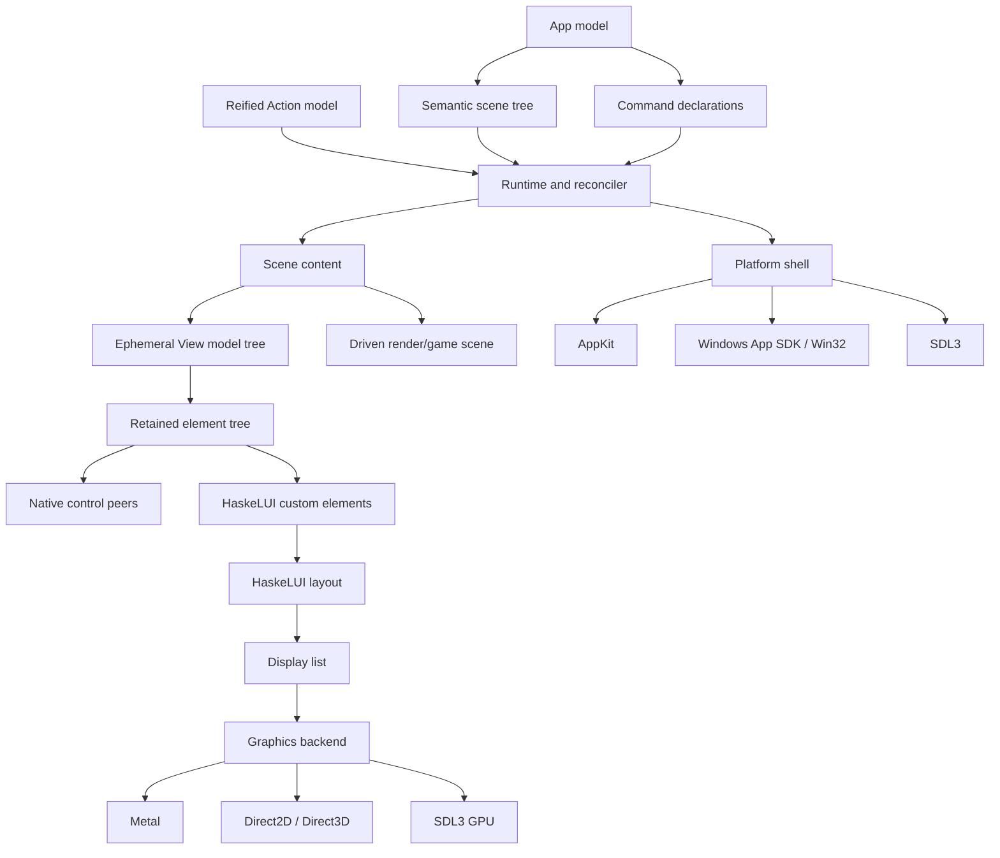

# HaskeLUI Architecture Proposal

Status: Draft for discussion, architecture revision 15
Audience: HaskeLUI users, contributors, and backend implementers
Scope: Public API, runtime architecture, backend boundaries, and initial delivery plan

## 1. Executive summary

HaskeLUI is a native Haskell application framework for building rich desktop applications. Its public API describes applications in terms of models, scenes, windows, commands, semantic controls, layout, and effects. It does not expose SDL, AppKit, WinUI, HTML, CSS, or a particular renderer.

The central architecture is:

```text
Haskell application
    -> semantic scenes, views, and commands
    -> runtime reconciliation
    -> platform shell and control realization
    -> native controls or HaskeLUI retained elements
    -> display list
    -> SDL3, Metal, Direct2D/Direct3D, or another renderer
```

HaskeLUI deliberately separates the application model from rendering:

- `App` describes the initial model, scenes, commands, effects, and subscriptions.
- `Scene` describes windows, document groups, settings, utilities, and other top-level surfaces.
- `View model` describes semantic controls and layout whose callbacks produce typed actions over `model`.
- `Action model` is a reified, inspectable transaction language for model properties, element properties, typed events, commands, and effects.
- `Property model value` wraps a composable lens with HaskeLUI identity and policy metadata; applications use a small `get`/`.=`/`modify`/`bind` vocabulary rather than learning the machinery of lenses.
- `Binding model control` defines how a control reads, drafts, validates, commits, synchronizes, and groups undo for an authoritative value; its hidden model-value type may differ from the control type.
- Ordinary bindings are pure. Impure validation is a separate, visibly attached `AsyncValidation control` declaration owned and cancelled by the retained runtime.
- The runtime reconciles short-lived declarative descriptions with persistent windows and elements.
- Backends interpret the semantic description using native controls, custom-rendered controls, or a controlled hybrid.
- SDL3 is an important backend, but it is not the foundation of the public API.
- Scene content is extensible so that future continuously rendered or game-oriented scene drivers can share the application, window, input, and resource runtime without being forced through the UI view language.

The existing `haskelui-legacy` repository remains a prototype and research reference. The new implementation will not depend on it and will not incrementally refactor its SDL2-shaped runtime.

## 2. Motivation

The legacy project demonstrated several important ideas:

- Native Haskell applications can own their event loop and rendering lifecycle.
- Pure model transitions, explicit effects, and declarative views are pleasant and testable.
- Basic layout, text, events, and FRP experiments are feasible.
- SDL is useful for cross-platform windows, input, and graphics.

It also exposed architectural limitations:

- A single application was equated with a single SDL window and renderer.
- SDL concepts reached too far into application runtime responsibilities.
- The widget tree was both the public API and an embryonic rendering representation.
- Focus, commands, text editing, accessibility, window lifecycle, and retained state lacked independent models.
- Styling and layout were being designed before the application and scene model was established.

SDL2 to SDL3 would already require substantial backend work. More importantly, the desired product has changed from “an SDL widget toolkit” into “a portable native Haskell application framework.” This justifies a clean implementation with an explicit semantic boundary.

## 3. Goals

### 3.1 Product goals

HaskeLUI should support applications such as:

- Multiwindow document editors
- IDE-like applications with tabs, split panes, trees, editors, and tool windows
- Data-oriented desktop applications with tables, forms, dialogs, menus, and shortcuts
- Utilities with settings windows, tray integration, notifications, and platform services
- Applications that mix ordinary controls with custom GPU-rendered surfaces
- Future applications that combine UI layers with continuously rendered 2D/3D or game-oriented scene content

### 3.2 API goals

The public API should be:

- Native Haskell rather than markup interpreted by another language
- Declarative and strongly typed
- Independent of backend and operating-system object types
- Explicit about effects and application state transitions
- Callback-oriented without making ordinary application behavior opaque to tooling
- Able to express familiar typed property assignment such as `documentTitle .= "New title"`
- Composable at application, scene, component, and view levels
- Capable of expressing semantic intent without fixing exact pixels
- Able to opt into exact custom rendering when required
- Testable without opening real windows

### 3.3 Runtime goals

The runtime should provide:

- Stable identity and reconciliation
- Multiple independently managed windows
- Retained widget state beneath an ephemeral view tree
- Focus scopes, routed events, pointer capture, and command routing
- Incremental invalidation rather than unconditional redraw
- Async effects integrated with the platform event loop
- Text input, IME, clipboard, drag-and-drop, and accessibility as core capabilities
- Backend conformance tests

### 3.4 Backend goals

The architecture should permit:

- A portable SDL3 custom-rendered backend
- A macOS AppKit backend
- A Windows backend using Windows App SDK/WinUI or a lower-level Win32 bridge
- Native platform shells combined with HaskeLUI custom-rendered content
- Native controls combined with custom-rendered islands under documented constraints
- Future renderers without changing application code
- Extensible scene-content drivers with on-demand, continuous, or fixed-step scheduling

### 3.5 Initial development toolchain

The project uses Stack for the Haskell build, test, benchmark, and executable workflow. The initial compiler baseline is the system-installed GHC 9.10.3 with `base-4.20.2.0`, as reported by the local package database. Stack configuration should select that compiler and use the system installation rather than silently downloading or selecting a different GHC.

Public API experiments must compile on this baseline. In particular, HaskeLUI may use `OverloadedLabels`, `OverloadedRecordDot`, `HasField`, generic lens derivation, and ordinary operators, but it must not depend on later GHC behavior or on experimental `OverloadedRecordUpdate`.

## 4. Non-goals

HaskeLUI is not intended to be:

- A browser engine
- A full implementation of HTML, the DOM, or CSS
- A pixel-identical abstraction over all native platforms
- A wrapper that exposes every AppKit or Windows property through one universal record
- A pure immediate-mode GUI
- A framework where every hover, cursor blink, or pointer movement produces an application action
- A promise that arbitrary custom styling can be applied to native controls
- A compatibility layer for the legacy public API
- A complete ECS, physics engine, audio engine, or general game engine in the first HaskeLUI release

Platform-specific functionality remains possible through explicit extension modules. It should not leak into portable core types.

## 5. Design principles

### 5.1 Semantics before pixels

Application code should say “primary button,” “document window,” “Save command,” or “tab workspace” before it says how those concepts are painted. This gives native backends enough meaning to select appropriate platform behavior and gives custom backends enough meaning to implement accessibility and conventions.

### 5.2 Separate application structure from window content

Windows are not ordinary widgets. They have operating-system identity, lifecycle, activation, restoration, commands, and resources. Scenes own windows; views describe their content.

### 5.3 Declarative descriptions, retained realization

Applications regenerate cheap descriptions. The runtime retains expensive and interaction-sensitive state: native handles, element instances, focus, IME sessions, scroll positions, text caches, GPU resources, and accessibility nodes.

### 5.4 Portable core, explicit capabilities

Portability is a semantic contract, not an assumption that every backend supports every detail. Optional features are reported as capabilities and have documented fallbacks.

### 5.5 Commands are independent of presentation

A menu item, toolbar button, context menu, and keyboard shortcut can invoke the same logical command. Command availability is resolved through focus and scope.

### 5.6 Specialized controls are legitimate

Rich desktop software needs more than rows, columns, and styled boxes. Tabs, data grids, trees, split panes, virtual lists, text editors, and docking workspaces receive dedicated models and behavior.

### 5.7 Escape hatches are designed, not accidental

Custom elements, platform extensions, and native-hosted islands are public concepts with lifecycle and capability contracts. They are not unsafe access to backend internals scattered through application code.

### 5.8 Callback ergonomics, reified meaning

Control handlers use callbacks, but callbacks normally construct `Action model` values rather than execute arbitrary `IO` or opaque mutations. Common actions remain inspectable, testable, nameable, and optionally replayable. Arbitrary pure transitions remain available as an explicitly opaque escape hatch.

### 5.9 One authoritative owner per value

Durable domain values use `Property model value`; retained UI-only values use the distinct `ElementProperty value` type. A value must not be simultaneously authoritative in both places. Rich operations that cannot be represented honestly as assignment use typed domain events.

### 5.10 Lenses underneath, properties at the surface

Total model properties use lenses as their construction and composition foundation. HaskeLUI does not equate a property with a raw lens: a property also carries stable identity and optional metadata needed by actions, diagnostics, codecs, undo, and tooling. The ordinary application API is deliberately smaller than a general lens library. Users primarily `get`, assign, modify, and bind named properties; experienced users can construct them from any compatible lens.

## 6. Vocabulary

`App`
: The application definition: initial model, scenes, commands, effects, and subscriptions.

`Action`
: A typed, reified request to change model state, update an element-owned property, emit a domain event, invoke a command, start an effect, or perform a batch.

`Transaction`
: A pure envelope around an atomic action batch with undo policy and a user-facing description; retained runtime origin and scope are attached when dispatched.

`Property`
: A typed, lens-backed path to authoritative application-model state, including stable identity and optional encoding and policy metadata.

`Binding`
: A first-class typed editing protocol between authoritative state and a control value. It defines reading, parsing, validation, writes, commit timing, undo grouping, and draft synchronization while hiding any different underlying model-value type.

`AsyncValidation`
: A separately attached, visibly impure validation declaration with identity, an `IO` request, result interpretation, debounce, and pending-commit policy. It is not part of pure `Binding`.

`ElementProperty`
: A typed handle to a retained element-owned value. Its lifetime follows the element rather than the application model.

`StateSource`
: An explicit ownership declaration for already-typed control state such as tab selection or committed pane geometry. It may be retained, restored, callback-controlled, or model-property-owned; unlike `Binding`, it has no parsing, invalid draft, validation, or undo protocol.

`Event`
: A typed domain operation interpreted by a subsystem reducer when assignment would lose important intent.

`Scene`
: A top-level application surface or family of surfaces, such as a document window group, settings window, utility panel, or tray presence.

`Window`
: A persistent platform resource created by realizing a window scene instance.

`View`
: A short-lived declarative description of controls and layout inside a scene.

`Element`
: A persistent runtime realization of a view node. It may own a native peer or be implemented by HaskeLUI.

`Native peer`
: An AppKit, WinUI, Win32, or other platform object representing an element.

`Command`
: A named logical operation with metadata, default shortcuts, availability, and focused handling.

`Effect`
: An explicit request for asynchronous or impure work whose result produces a later action.

`Subscription`
: A declaration of external events the application wants converted into actions.

`Scene content`
: The content domain hosted by a scene, such as semantic UI, a custom driven render scene, or a native-hosted surface.

`Backend`
: A composition of shell, control, graphics, text, accessibility, and platform-service adapters.

`Display list`
: A backend-independent ordered description of painting operations produced by custom elements.

## 7. Conceptual architecture



No arrow from application code directly reaches SDL, AppKit, WinUI, Metal, or another implementation API.

## 8. Public application and action API

The following types are illustrative. They define architectural roles, not final names or exact Haskell encodings.

```haskell
data App model = App
  { appInitial       :: (model, [Effect model])
  , appScenes        :: model -> [Scene model]
  , appCommands      :: model -> [CommandSpec model]
  , appSubscriptions :: model -> [Subscription model]
  }
```

The primary API is callback-oriented. A callback returns a pure, reified action rather than executing arbitrary `IO`:

```haskell
button
  :: Text
  -> [ButtonOption model]
  -> View model

onClick
  :: Action model
  -> ButtonOption model

textField
  :: [TextFieldOption model]
  -> View model

value
  :: Text
  -> TextFieldOption model

onChange
  :: (Text -> Action model)
  -> TextFieldOption model
```

The action language is conceptually:

```haskell
data Action model where
  SetModel
    :: Property model value
    -> value
    -> Action model

  SetElement
    :: ElementProperty value
    -> value
    -> Action model

  Emit
    :: Event model event
    -> event
    -> Action model

  Invoke
    :: CommandId
    -> Action model

  Batch
    :: [Action model]
    -> Action model

  Start
    :: Effect model
    -> Action model

  Opaque
    :: ActionName
    -> (model -> Transition model)
    -> Action model
```

`SetModel`, `Emit`, `Invoke`, and `Batch` preserve enough meaning for logging and pure interpretation. They are replayable when their property values or event payloads provide codecs. `Opaque` is deliberately marked as non-serializable unless the application supplies additional metadata.

An MVU/reducer style remains available as an optional organization technique:

```haskell
dispatch
  :: (msg -> model -> Transition model)
  -> msg
  -> Action model
```

It is not required by ordinary component composition.

### 8.1 Properties and typed events

The standard model-property implementation is a named lens wrapped in HaskeLUI semantics:

```haskell
data Property model value = Property
  { propertyId      :: PropertyId
  , propertyLens    :: Lens' model value
  , propertyCodec   :: Maybe (Codec value)
  }

data ElementProperty value = ElementProperty
  { owningElement   :: ElementKey
  , elementProperty :: ElementPropertyId value
  }

data Event model event = Event
  { eventId         :: EventId
  , reduceEvent     :: event -> model -> Transition model
  , eventCodec      :: Maybe (Codec event)
  }
```

A raw lens is only a getter/setter focus. The `Property` wrapper additionally gives that focus stable identity and a place for encoding, diagnostics, action metadata, and tooling policy. HaskeLUI therefore does not define `Property` as a type synonym for `Lens'`; edit-session policy lives in `Binding` instead.

Properties may be created from handwritten, generated, or generically derived lenses. With overloaded field labels, ordinary nested records can be exposed with little ceremony:

```haskell
documentTitle :: Property Model Text
documentTitle =
  property "document.title" (#document . #title)

property
  :: PropertyId
  -> Lens' model value
  -> Property model value

-- Explicit interoperability spelling:
fromLens
  :: PropertyId
  -> Lens' model value
  -> Property model value
```

The ordinary surface vocabulary is deliberately small:

```haskell
get
  :: Property model value
  -> model
  -> value

(.=)
  :: Property model value
  -> value
  -> Action model

modify
  :: Property model value
  -> (value -> value)
  -> Action model

bind
  :: Property model value
  -> Binding model value
```

This is the conceptual signature. The concrete binding constructors also accept a checked dotted `Path model value`, so application code can write `bind properties.document.title` directly without an explicit `asProperty` conversion.

Examples:

```haskell
text (get documentTitle model)

button "Rename"
  [onClick (documentTitle .= "New title")]

textField (bind documentTitle) []

emit editorEvents
  (InsertText cursor "hello")

setElement window1.label2.highlighted True
```

Property composition is also first-class:

```haskell
(>.)
  :: Property outer inner
  -> Property inner value
  -> Property outer value

documentTitle = documentProperty >. titleProperty
```

Composition combines the underlying lenses and qualified property identities. This makes reusable child components possible without manually routing their actions.

The explicit `PropertyId` is authoritative metadata in the manual form, so it can accidentally disagree with its lens. The preferred ordinary form derives both the lens and qualified identity from one dotted path:

```haskell
properties :: Path Model Model
properties = rootPath

rename =
  properties.document.title .= "New title"
```

The GHC 9.10.3 property spike validates this syntax with a generic virtual `HasField` instance backed by `generic-lens`. Each segment contributes its generic lens and type-level field name, producing the identity `document.title` without a duplicated string or Template Haskell. Invalid fields produce a focused compile error naming the missing field and its containing type.

The dotted left side is an `OverloadedRecordDot` expression over HaskeLUI path values, followed by HaskeLUI's ordinary `.=` operator. It is not a nested record update and does not require `OverloadedRecordUpdate` or `RebindableSyntax`. `property "document.title" (#document . #title)` remains the explicit construction and interoperability form.

Total `Property` values always focus exactly one model value. A partial focus
into a collection or sum type uses the implemented, distinct
`OptionalProperty`: reads return `Maybe`, while writes and modifications return
`Either PropertyApplyError`. It deliberately does not support `.=` because an
ordinary `Action model` has no failure channel.

Model and element properties remain different types. Model properties are durable and authoritative. Element properties are runtime-owned, lifetime-scoped handles intended for uncontrolled or transient presentation state. A model-bound element must not expose an independently authoritative mutable element property for the same value.

### 8.2 Components and child state

A component is a pure rendering abstraction rather than a mounted object with hidden semantic state:

```haskell
newtype Component model = Component
  { renderComponent :: model -> View model
  }

data ChildState parent child = ChildState
  { getChild :: parent -> child
  , setChild :: child -> parent -> parent
  }

embed
  :: Property parent child
  -> Component child
  -> parent
  -> View parent

embedWith
  :: ChildState parent child
  -> Component child
  -> parent
  -> View parent
```

`embed` composes child properties, events, effects, and actions through the parent property once at the component boundary. No parent message constructor or repetitive routing case is required:

```haskell
editorProperty :: Property Document Editor
editorProperty = property "editor" #editor

documentView document =
  embed editorProperty editorComponent document
```

`ChildState` and `embedWith` remain a manual fallback for models that do not expose a lens. They can be defined using ordinary record access:

```haskell
editorState =
  ChildState
    { getChild = editor
    , setChild = \newEditor document ->
        document { editor = newEditor }
    }
```

Users do not need to understand lens implementation details to use `Property`, but lens interoperability is standard rather than an optional afterthought. The compiled property spike selected a minimal van Laarhoven-compatible representation plus `generic-lens`; whether generic derivation lives in `haskelui-core` or a standard re-exported adapter remains open.

Dynamic keyed children require an analogous component boundary:

```haskell
scopeAt
  :: Ord key
  => Property parent (Map key child)
  -> key
  -> Component child
  -> parent
  -> View parent
```

`scopeAt` lifts child actions through the keyed collection while the key exists. If a callback arrives after the item is removed, the runtime safely drops it with a diagnostic rather than updating another item. The final abstraction may generalize beyond `Map`, but keyed lifetime and action lifting are part of its contract.

### 8.3 Controlled and uncontrolled state

HaskeLUI distinguishes:

- Durable semantic state stored in the application or nested component model
- Retained element mechanics such as hover, pressed state, pointer capture, caret blinking, and intermediate IME state
- Deliberately uncontrolled local UI properties whose lifetime follows a stable element key

Controls may offer controlled and uncontrolled forms. State that must be persisted, coordinated, undone, synchronized, or reasoned about by the application belongs in model properties. Runtime-local state must not be duplicated into the model without a clear ownership transfer.

Already-typed control state that needs these ownership choices uses an opaque
`StateSource model value`: `retainedState`, `restoredState`, `controlledState`,
or `propertyState`. The consuming control defines its publication boundary. For
example, tab selection publishes immediately while a splitter publishes its
committed pane geometry at the end of a live drag. Editable values continue to
use `Binding`; `StateSource` does not acquire parsing, validation, draft, or undo
semantics. Restored values require a stable `Restorable` codec or an explicit
`Codec value`; restoration never falls back to implicit `Show`/`Read` formats.

### 8.4 Stable typed keys

Identity-bearing resources use typed keys:

```haskell
newtype Key a = Key Text

type SceneKey    = Key SceneTag
type WindowKey   = Key WindowTag
type DocumentKey = Key DocumentTag
type ViewKey     = Key ViewTag
type TabKey      = Key TabTag
```

Typed keys prevent accidental interchange between identity domains. The concrete representation may later support efficient generated keys in addition to textual keys.

## 9. Scene and window model

An application declares scene instances from its model:

```haskell
data Scene model
  = WindowScene WindowKey (WindowSpec model)
  | WindowGroup SceneKey [WindowInstance model]
  | DocumentGroup SceneKey [DocumentInstance model]
  | SettingsScene (WindowSpec model)
  | UtilityScene WindowKey (WindowSpec model)
  | TrayScene (TraySpec model)
```

Example:

```haskell
appScenes model =
  [ documentGroup documentsScene (openDocuments model) documentScene
  , settingsScene (settingsWindow model.settings)
  ]

documentScene document =
  documentWindow (documentWindowKey document.id) document.id
    [ windowTitle document.title
    , windowRestorationKey (documentRestorationKey document.id)
    , onWindowCloseRequest $ \_ ->
        properties.documents.at document.id.closeRequested .= True
    ]
    (documentWorkspace document)
```

### 9.1 Reconciliation

`appScenes` is a desired-state declaration. The runtime compares it with live scene instances:

- A new `WindowKey` creates a window.
- An existing key updates window properties and content without recreating the native window.
- A removed key begins the appropriate close/disposal lifecycle.
- Reordering declarations does not change identity.

### 9.2 Platform-initiated lifecycle

Some lifecycle originates outside the model:

- The user presses Command-N or chooses New Window.
- The operating system asks the app to open a file or URL.
- The user requests that a window close.
- The system restores previous windows.
- Another process activates an existing application instance.

The shell backend turns these into actions or subscription events. The runtime interprets the action against the current model, after which scene reconciliation performs the requested change.

Close is a request, not immediate destruction. This permits unsaved-document confirmation and close veto. Forced termination remains a distinct platform event with limited guarantees.

### 9.3 Window state ownership

Window state is divided deliberately:

- Semantic state such as the selected document belongs to the application model.
- Restorable scene state such as the selected tab may be application- or scene-owned depending on persistence requirements.
- Platform placement, live resize state, native handles, and backing surfaces belong to `WindowRuntime`.
- Applications may subscribe to placement changes if they need to persist them.

### 9.4 Extensible scene content

UI views are one scene-content domain, not the universal representation of all renderable content:

```haskell
data SceneContent model where
  UIContent
    :: View model
    -> SceneContent model

  DrivenContent
    :: SceneDriver scene model
    -> scene
    -> SceneContent model

data FramePolicy
  = OnDemand
  | Continuous
  | FixedStep Hertz
```

A future game or simulation layer may provide its own spatial scene representation and `SceneDriver` while sharing application lifecycle, windows, input normalization, actions, effects, resources, and UI overlays. Physics, ECS, audio, animation, and 2D/3D render semantics remain separate domains rather than being forced through `View model`. A game engine is therefore an extensible scene-content frontend plus renderer/runtime services, not merely another UI control backend.

## 10. Commands, actions, and menus

Commands are logical operations independent of controls:

```haskell
command Save
  & label "Save"
  & standardShortcut StandardSave

menuItem     (invoke Save)
toolbarItem  (invoke Save)
contextItem  (invoke Save)
keyBinding   StandardSave (invoke Save)
```

View scopes register command handlers:

```haskell
focusScope
  [ handles Save saveFocusedDocument
  , handles Copy copyFocusedSelection
  , handles Paste pasteIntoFocusedControl
  ]
  editorView
```

Resolution order is:

```text
focused element
    -> enclosing focus/command scopes
    -> window scope
    -> application scope
```

The first enabled handler wins. The resolved handler determines command availability and checked state. Native menus can therefore reflect the state of the currently focused editor without application code manually synchronizing each menu item.

The compiled multiwindow-editor sketch validates this separation: Save is declared once as command metadata, invoked identically by a button, menu, and shortcut, and handled inside each document window's focus scope. The application model does not mirror the currently focused document merely to route commands. Focus remains retained runtime state unless the application has an independent semantic reason to persist it.

Commands and ordinary control actions are related but distinct:

- A command has stable identity and can be invoked from multiple presentations.
- A local callback may assign a model property, assign an element property, emit a typed event, start an effect, or return an opaque named action.
- A control may invoke a command rather than duplicate its operation.

Backend adapters map command metadata to native equivalents where available. HaskeLUI retains semantic ownership even when the platform presents the menu or shortcut.

## 11. Event and focus system

### 11.1 Event pipeline

```text
platform input
    -> normalization
    -> target selection or focused delivery
    -> capture phase
    -> target phase
    -> bubble phase
    -> control gesture/state transition
    -> command or application action
```

The normalized event model covers pointer, keyboard, text input, composition, drag-and-drop, window, and accessibility actions without exposing backend event types.

### 11.2 Runtime-local interaction

These changes normally remain inside the retained runtime:

- Hover and pressed visuals
- Cursor blinking
- Pointer capture during a drag
- Intermediate IME composition state
- Native control tracking
- Scrollbar hover and momentum
- Window live-resize painting

Meaningful application callbacks construct `Action model` values. The runtime interprets structured actions deterministically without forcing high-frequency implementation details into the model.

### 11.3 Focus

Focus is per window, with explicit nested focus scopes. The runtime tracks:

- Focused semantic element
- Native focused peer, if any
- Focus traversal order and policy
- Last focused descendant of each scope
- Focus reason such as pointer, tab traversal, shortcut, activation, or programmatic request
- Text input and IME ownership

Focus changes participate in command resolution and accessibility notifications.

## 12. View language

`View model` is an opaque typed declarative description whose handlers produce actions over `model`. It is not a DOM node and is not expected to persist between update cycles. Internal constructors remain hidden so reconciliation, lowering, and backend realization may evolve without exposing the semantic IR.

### 12.1 Semantic controls

Initial semantic controls should include:

- Text and rich text display
- Button and command button
- Toggle, checkbox, and radio choice
- Single-line text field
- Multiline text editor
- Selection control
- Slider and numeric input
- Image/icon
- Menu, context menu, toolbar, and status items
- Dialog, popover, tooltip, and anchored overlay

### 12.2 Desktop structures

Dedicated structures should include:

- Scroll view
- Virtual list
- Tree view
- Data grid
- Tab view
- Tab workspace
- Split pane and pane tree
- Outline/sidebar
- Inspector or property grid
- Editor surface

These are not all required for the first milestone. They are first-class architectural concepts so that the initial primitive API does not prevent them.

### 12.3 Layout primitives

Portable layout concepts include:

- Row and column
- Grid
- Overlay/stack
- Absolute or canvas positioning where explicitly requested
- Padding, gaps, alignment, and distribution
- Fixed, minimum, maximum, intrinsic, and flexible sizing
- Aspect ratio
- Scroll and viewport constraints

The initial layout model may borrow proven flexbox and grid semantics, but HaskeLUI will expose typed Haskell values rather than parse CSS strings.

### 12.4 Custom elements

Custom elements are used for cases such as:

- Code editors
- Graphs and timelines
- Canvas-like design tools
- High-volume virtualized surfaces
- Domain-specific visualization

A custom element participates in measurement, arrangement, hit testing, focus, accessibility, invalidation, and display-list generation. It does not receive unrestricted access to the entire renderer.

### 12.5 Action and property usage

Simple state changes should read locally:

```haskell
button "Rename"
  [onClick (documentTitle .= "New title")]

textField
  (controlled currentTitle (documentTitle .=))
  []

-- Or, when the control supports two-way model binding:
textField (bind documentTitle) []
```

Property assignment is not immediate mutation of a native widget. It creates a typed action that is interpreted atomically against the current application model. Complex domains retain their intent through typed events:

```haskell
textEditor document.text $ \operation ->
  emit editorEvents operation
```

Multiple operations may be batched into one transaction, invalidation pass, and undo unit.

### 12.6 Binding and edit transactions

`Property model value` answers only “where does authoritative state live?” It deliberately does not own parsing, transient drafts, validation, commit timing, dirty-state policy, or undo behavior. Those concerns belong to a first-class `Binding model control`.

The two type parameters describe the types visible at the boundary:

- `model` is the application or component model changed by committed actions.
- `control` is the value edited by the control, such as `Text` for a text field.

The authoritative property value is existentially hidden inside the binding. It may equal `control`, as with `Property Document Text`, or differ, as when a text field edits `Property Settings Int` through a typed codec.

```text
authoritative model value
        |
        | format/read
        v
control value -> retained draft -> parse -> validate -> commit policy
                    |                         |
                    | invalid/staged          | valid commit
                    v                         v
             ElementProperty          one Transaction value
                                            |
                                            +-- atomic Action batch
                                            +-- undo policy
                                            +-- description
```

The simple case stays small:

```haskell
textField (bind properties.document.title) []
```

`bind` means lossless, live, direct property assignment with no validation and no automatic undo policy. More realistic editing uses `bindWith`:

```haskell
textField
  ( bindWith properties.document.title
      [ alsoWrite (const (properties.document.dirty .= True))
      , validateWith nonEmptyTitle
      , commitPolicy Live
      , undoPolicy (Coalesce (UndoGroup "rename-document"))
      , syncPolicy DetectConcurrentChange
      , labelTransaction "Rename document"
      ]
  )
  []
```

`writeWith` replaces the default property assignment when an edit is better represented by a typed domain event:

```haskell
bindWith properties.document.title
  [ writeWith (emit documentRenamed)
  , commitPolicy OnEnterOrBlur
  ]
```

`alsoWrite` adds related state changes to the same action transaction. The runtime must not expose an intermediate model where the title changed but `dirty` did not. Domain-wide policies can instead be centralized in the reducer reached through `writeWith`.

Formatted editing requires both directions explicitly:

```haskell
fontSizeBinding =
  bindText properties.settings.fontSize
    (textCodec (Text.pack . show) parseFontSize)
    [ validateWith (between 8 96)
    , commitPolicy OnEnterOrBlur
    , undoPolicy (SingleUndo (UndoGroup "change-font-size"))
    , syncPolicy PreserveLocalDraft
    , labelTransaction "Change font size"
    ]
```

The initial commit policies are:

- `Live`: commit each valid input change.
- `OnEnter`: stage edits until Enter.
- `OnBlur`: stage edits until focus leaves the control.
- `OnEnterOrBlur`: commit on either event.
- `ExplicitApply`: commit only through an explicit apply operation.

Parsing and synchronous validation run while editing so controls can present feedback before commit. A parse or validation failure leaves the exact control value in retained element state and does not weaken or modify the authoritative model. Staged valid drafts also remain element-owned until their commit trigger.

Successful edits produce an explicit pure value rather than an action loosely paired with metadata:

```haskell
data Transaction model = Transaction
  { transactionAction      :: Action model
  , transactionUndo        :: UndoPolicy
  , transactionDescription :: Maybe Text
  , transactionEffects     :: [Effect]
  , transactionCommands    :: [RuntimeCommand model]
  }
```

`UndoEveryEdit` creates a unit per commit, `Coalesce group` merges adjacent compatible live edits, and `SingleUndo group` represents a commit as one unit. When a control dispatches the transaction, the runtime adds origin information such as element identity, scene/document scope, and interaction time. The undo engine still requires a separate ADR covering snapshots versus inverse actions, reducer events, nesting, effects, and persistence.

Draft synchronization is pure three-way comparison. At edit start, the retained control captures a typed, opaque `DraftBaseline` containing the original authoritative value. When the model changes, `reconcileDraft` compares:

```text
original authoritative value
local control draft
current authoritative value
```

If the local draft is pristine, the current value refreshes it. If only the local draft changed, it is preserved. If both changed, `DetectConcurrentChange` returns an explicit `BindingConflict` containing the original, local, and current control values. No branch silently overwrites both changes.

The initial synchronization policies are:

- `RefreshIfPristine`: refresh untouched drafts and otherwise preserve the local draft.
- `PreserveLocalDraft`: always preserve the local draft across authoritative changes.
- `DetectConcurrentChange`: report a three-way conflict when both sides changed.

Live bindings default to `RefreshIfPristine`; staged bindings default to `DetectConcurrentChange`. IME composition temporarily preserves the native draft regardless of ordinary synchronization policy.

All of the preceding binding pipeline is pure. `Binding`, parsing, formatting, synchronous validation, baseline capture, draft reconciliation, action construction, and transaction construction contain no `IO`.

Asynchronous validation is a separate declaration and therefore visible at both the type and use sites:

```haskell
titleAvailability :: AsyncValidation Text
titleAvailability =
  asyncValidation
    (ValidationId "document-title.available")
    Right
    checkTitleAvailability                 -- request -> IO response
    interpretAvailability
    [ debounce (Milliseconds 250)
    , commitWhilePending BlockCommit
    ]

textField
  documentTitleBinding
  [validateAsync titleAvailability]
```

`asyncValidation` visibly accepts an `IO` runner; it is not a `BindingOption` and cannot make the pure binding implicitly effectful. The retained runtime owns each request and must associate it with the element identity and edit revision, cancel obsolete work where possible, ignore stale results unconditionally, and dispose it with the element.

The production module `HaskeLUI.Binding` contains only the pure binding, draft,
conflict, and transaction-construction surface. The future
`HaskeLUI.Validation.Async` module will contain `AsyncValidation`, its `IO`
constructor, and runtime policies. An umbrella `HaskeLUI` package may re-export both,
but types and call sites continue to expose which layer is impure.

The initial pending-result policies are:

- `BlockCommit`: a current successful result is required before commit.
- `OptimisticCommit`: commit may proceed while validation runs; a later failure is presented and may trigger explicit application policy.
- `AdvisoryOnly`: validation only supplies feedback and never controls commit.

Async control validation is not the authority for domain correctness. Rules such as server uniqueness or authorization must also be enforced by the typed event/effect that performs the authoritative operation. This keeps UI feedback responsive without hiding impure correctness logic inside a control.

The binding is the positional value source of an editable control:

```haskell
textField binding textFieldOptions
```

It is not another option alongside independent `value` and `onChange` options, because that would permit two competing authorities. Callback-oriented controlled use remains available without a `Property`:

```haskell
textField (controlled currentTitle onTitleChanged) []
```

The production GHC 9.10.3 Core implementation compiles and tests direct
assignment, dirty-state batching, value-only and model-aware synchronous
validation, generic codecs, invalid-draft preservation, commit triggers,
explicit transactions, pure three-way synchronization, and conflict reporting.
It does not yet implement retained staged-draft controls, async request
cancellation, or the undo interpreter.

These decisions are recorded in [ADR 0001](../adr/0001-pure-bindings-transactions-and-async-validation.md).

### 12.7 Property and element ownership

`Property model value` and `ElementProperty value` deliberately do not unify:

- A model property is a stable path into authoritative state.
- An element property is valid only while its keyed retained element exists.
- Stale element assignments safely no-op or produce a diagnostic; they never target a replacement element accidentally.
- A declaratively model-bound value cannot also be independently element-owned.
- Runtime element mutation is intended for transient presentation and integration, not hidden domain state.

Model properties use `.=`. Element properties use the visibly ownership-specific `setElement`. The compiled spike showed that overloading `.=` for model-free `ElementProperty value` makes the application model ambiguous when an action is inspected outside an enclosing `View model` context.

## 13. Appearance, styling, and themes

HaskeLUI distinguishes semantic appearance from exact paint.

### 13.1 Semantic appearance

Semantic properties map naturally to native or custom controls:

```haskell
role Primary
controlSize Regular
emphasis Strong
density Comfortable
validation Invalid
enabled False
selectionMode Multiple
```

Backends interpret these according to platform conventions and the active theme.

### 13.2 Layout style

Layout properties are generally portable:

```haskell
padding 8
gap 6
minWidth 120
grow 1
alignItems Center
```

Minor differences caused by native intrinsic sizes and typography are acceptable unless an application chooses framework-managed custom realization.

### 13.3 Exact paint

Properties such as these imply custom rendering or documented degradation:

```haskell
backgroundColor ...
linearGradient ...
borderRadius ...
boxShadow ...
transform ...
blendMode ...
```

HaskeLUI should not claim that an arbitrary shadow or gradient can be imposed on every native control.

### 13.4 Realization preference

Applications may express a preference:

```haskell
automatic
preferNative
preferCustom
requireNative
requireCustom
```

`automatic` is the normal choice. The backend selects the best realization using control semantics, styling requirements, capabilities, accessibility, and composition restrictions.

Failure to satisfy `requireNative` or `requireCustom` is a diagnostic rather than silent substitution. Preferences may be applied to a subtree, but hybrid composition is constrained by native peer z-ordering, clipping, transforms, and accessibility behavior.

### 13.5 Themes and environment

Environment values flow down the semantic tree:

- Theme and semantic color roles
- Locale and writing direction
- Display scale
- Font defaults and text scale
- High contrast
- Reduced motion
- Platform conventions
- Input modality
- Backend capabilities

HaskeLUI will not initially implement CSS selectors, specificity, or a global cascade. Typed modifiers, reusable styles, and environment/theme values provide the primary composition mechanism.

## 14. View identity and reconciliation

The runtime synchronizes three related structures:

1. The newly generated `View` tree
2. Persistent reconciliation state
3. The retained element/native-peer tree

### 14.1 Identity

Identity is structural by default and explicit for dynamic collections or resources:

```haskell
virtualList items $ \item ->
  keyed item.id (itemRow item)
```

Stable identity preserves:

- Native peer instances
- Focus
- Selection and editing state
- Scroll positions
- Cached measurements and text layout
- Accessibility identity
- GPU resources

### 14.2 Reconciliation operations

The internal reconciler produces operations conceptually similar to:

```haskell
CreateNode NodeId NodeKind Properties
UpdateProperties NodeId PropertyDelta
InsertChild NodeId ParentId Position
MoveChild NodeId ParentId Position
RemoveNode NodeId
ReplaceNode NodeId NodeKind
UpdateHandlers NodeId HandlerSet
```

Backends consume these operations transactionally where possible. Native peers and custom elements are not recreated merely because a new Haskell value was produced.

### 14.3 Invalidation

Changes separately invalidate:

- Semantics/accessibility
- Measurement
- Arrangement
- Paint
- Hit-testing structures
- Command availability

The runtime schedules work only for affected windows. It does not redraw continuously unless animation, live resize, media, or a custom surface requests it.

## 15. Layout realization

There are two viable layout strategies:

### 15.1 Framework-managed layout

HaskeLUI computes geometry using a common layout engine. Native leaf controls provide intrinsic measurement and are assigned frames by their adapter.

Advantages:

- Predictable portable composition
- One model for custom and native elements
- Easier split panes, overlays, and mixed trees

Costs:

- Native controls must be measured accurately
- Some native containers and platform adaptation are bypassed

### 15.2 Native-managed layout

The adapter lowers HaskeLUI layout concepts to AppKit constraints, WinUI panels, or another native system.

Advantages:

- Strong platform adaptation
- Native container behavior

Costs:

- More backend work
- Greater cross-platform layout divergence
- Difficult hybrid and specialized layout behavior

### 15.3 Accepted and implemented decision

Portable control geometry uses framework-managed layout for native and custom
backends. Native adapters perform a cached measurement phase, the pure Core
solver produces stable-keyed top-left frames, and adapters commit those frames
to retained peers. Native scroll, group, and disclosure hosts preserve their
platform semantics without becoming an independent source of child geometry.
Specialized virtualized collections and interactive workspace panes retain
their dedicated semantic protocols. See the [portable layout system](layout-system.md)
and [ADR 0005](../adr/0005-pure-portable-layout.md).

## 16. Backend architecture

A backend is assembled from focused adapters rather than implemented as one monolith:

```haskell
data Backend = Backend
  { backendShell         :: ShellBackend
  , backendControls      :: ControlBackend
  , backendGraphics      :: GraphicsBackend
  , backendText          :: TextBackend
  , backendAccessibility :: AccessibilityBackend
  , backendServices      :: PlatformServices
  , backendCapabilities  :: BackendCapabilities
  }
```

These records are runtime implementation concepts. Application code normally selects a packaged backend with a function such as:

```haskell
runApp :: Backend -> App model -> IO ()
```

### 16.1 Shell backend

Responsibilities:

- Process/application lifecycle
- Event-loop integration
- Window and panel creation
- Activation and focus-window tracking
- Window title, chrome, placement, and restoration
- Menus and standard application commands
- File-open and URL-open requests
- Tray and notifications where supported
- Surface creation for custom content

### 16.2 Control backend

Responsibilities:

- Determine native or custom realization for semantic controls
- Create, update, move, and dispose native peers
- Bridge native events to semantic control actions
- Measure native controls
- Synchronize focus and command state
- Host custom-rendered islands or native islands

### 16.3 Graphics backend

Responsibilities:

- Render surfaces and presentation
- Display-list execution
- Clipping, transforms, paths, gradients, shadows, and images
- Resource upload, caching, and disposal
- Damage tracking support
- Device loss and surface recreation

### 16.4 Text backend

Responsibilities:

- Font discovery and fallback
- Script and language-aware shaping
- Bidirectional text
- Line breaking and wrapping
- Glyph measurement and rasterization
- Caret, hit-testing, and selection geometry
- Integration with custom text controls and accessibility

SDL_ttf 3 is a useful implementation component because it integrates FreeType and HarfBuzz, but it does not by itself implement a complete editable-text system.

### 16.5 Accessibility backend

Responsibilities:

- Convert the semantic accessibility tree to platform APIs
- Maintain stable accessibility identity
- Expose roles, names, values, relationships, selection, and actions
- Route accessibility actions back to commands or application actions
- Announce focus and live-region changes

Accessibility semantics must exist before painting. They cannot be reconstructed reliably from a display list.

### 16.6 Platform services

Services include:

- Clipboard
- File and folder dialogs
- Drag-and-drop
- URL opening
- Notifications
- System appearance
- Timers and task wakeups
- Cursor selection
- Screen and display information
- Optional platform extension lookup

## 17. Example backend compositions

| Configuration | Shell | Controls | Text | Graphics |
|---|---|---|---|---|
| Portable SDL3 | SDL3 | HaskeLUI custom | SDL_ttf 3 plus HaskeLUI text runtime | SDL3 GPU/renderer |
| macOS custom | AppKit | HaskeLUI custom with selected native islands | CoreText or another shaped-text adapter | Metal or SDL3 GPU |
| macOS native | AppKit | AppKit controls | Native controls/CoreText | Native/custom surfaces as needed |
| Windows custom | Windows shell | HaskeLUI custom with selected native islands | DirectWrite or another shaped-text adapter | Direct2D/Direct3D or SDL3 GPU |
| Windows native | Windows App SDK or Win32 | WinUI/Win32 controls | Native controls/DirectWrite | Native/custom surfaces as needed |

Representative semantic mappings:

| HaskeLUI concept | macOS | Windows | SDL3 custom |
|---|---|---|---|
| Window | `NSWindow` | `AppWindow`/`HWND` | `SDL_Window` |
| Button | `NSButton` | WinUI `Button` | HaskeLUI button element |
| Text field | `NSTextField`/`NSTextView` | `TextBox`/`RichEditBox` | HaskeLUI text element and IME bridge |
| Menu command | `NSMenuItem` and responder chain | command/menu APIs | HaskeLUI command router and menu presentation |
| Scroll view | `NSScrollView` | WinUI `ScrollViewer` | HaskeLUI scroll element |
| Custom surface | `NSView`/Metal layer | swap-chain/custom drawing host | SDL renderer/GPU surface |

The mappings are semantic, not promises of identical appearance or every platform-specific behavior.

## 18. Native and custom composition

Native controls and custom rendering can coexist, but arbitrary mixing is not free.

Common restrictions include:

- Native controls often occupy rectangular child-window or view slots.
- Native peers may not compose correctly beneath custom translucent content.
- Arbitrary transforms, masks, and clipping may force custom realization.
- Z-order behavior differs across platforms and hosting technologies.
- Native popups may escape the custom surface hierarchy.
- Accessibility focus must remain synchronized across both trees.

HaskeLUI therefore treats hybrid boundaries explicitly. The backend may group adjacent custom elements into one render surface and host native peers in declared slots. Diagnostics explain when a requested composition cannot be satisfied.

## 19. Text input and editing

Text is a subsystem, not just a paint primitive.

### 19.1 Display text

Display text requires shaping, fallback, bidi processing, wrapping, measurement, selection geometry for accessibility, and stable caching.

### 19.2 Editable text

Editable controls additionally require:

- Logical text and selection model
- Caret movement by grapheme, word, line, and document
- IME composition ranges and candidate-window placement
- Clipboard and standard editing commands
- Undo grouping
- Mouse and touch selection
- Scrolling to caret
- Password/security behavior where applicable
- Accessibility text interfaces

Native backends should use native text controls when they satisfy the requested behavior and styling. The custom backend needs an explicit text-editing runtime; wrapping SDL_ttf is not sufficient.

### 19.3 Generic attributed text and presentation

Core text styling is generic and contains no syntax-specific vocabulary:

```haskell
data TextSpan a = TextSpan
  { textSpanRange :: TextRange
  , textSpanValue :: a
  }

data TextRun = TextRun
  { textRunValue :: Text
  , textRunStyle :: TextStyle
  }

data TextLayer = TextLayer
  { textLayerKey      :: TextLayerKey
  , textLayerRevision :: TextRevision
  , textLayerSpans    :: [TextSpan TextStyle]
  }
```

`TextStyle` is a partial portable set of foreground/background colors, font family, size, weight and slant, underline, strikethrough, letter spacing, and baseline offset. `TextRun` is the safe construction form for continuous authored styled strings; opaque `AttributedText` normalizes those runs into one character snapshot plus validated spans.

Authored rich-text spans and derived presentation layers share range and style primitives but not ownership. Authored styles participate in persistence, clipboard, dirty state, and undo. Presentation layers are revision-bound, non-authoritative overlays for syntax, diagnostics, search, spellchecking, or annotations. Ordered layers merge property-by-property, so a search background does not erase a syntax foreground. Stale layers and invalid ranges are ignored.

Public `TextRange` uses Unicode scalar boundaries. Parser byte offsets, AppKit/Windows UTF-16 units, and custom-renderer indices remain backend or adapter details.

### 19.4 Syntax highlighting

Syntax highlighting is a producer of generic presentation layers, not a Core feature. A language package defines its own semantic vocabulary and resolves it through a theme before constructing a `TextLayer`:

```haskell
highlightHaskell :: Text -> [TextSpan SyntaxClass]
syntaxStyle      :: SyntaxClass -> TextStyle
```

Applying presentation must not mutate characters, authored attributes, selection, marked IME text, or undo. AppKit uses `NSLayoutManager` temporary attributes after converting scalar ranges to UTF-16; a custom renderer merges the same layers into shaped glyph runs. The first editor implementation uses a pure full-document Haskell lexer. Large inputs can later move revisioned work to the explicit task executor and incremental changed-range processing without changing the Core representation.

## 20. Documents, tabs, and workspaces

The detailed accepted surface design is recorded in
[Document windows and workspace windows](window-workspace-surface-api.md).

### 20.1 Documents

A document model should eventually coordinate:

- Identity and file location
- Open/create/save/save-as/revert
- Dirty state
- Autosave
- Undo/redo integration
- Close negotiation
- External file changes
- Restoration
- Multiple windows or views over one document

The framework should provide conventions and services without requiring every application to use a single document data type.

### 20.2 Tabs

HaskeLUI distinguishes:

- `TabView`: selectable pages inside one view
- Window tabbing: operating-system grouping of scene instances
- `TabWorkspace`: application-managed documents/tools that can move among panes and windows

The concrete surface names the last concept `workspaceTabGroup`. It uses separate
`TabKey`, `DocumentKey`, `TabGroupKey`, and `WindowKey` identities. A tab close or
transfer is a request interpreted by application state; controls never directly
destroy a document, tab, or window.

### 20.3 Workspace model

A rich application may use:

```haskell
data Workspace = Workspace
  { workspaceWindows :: Map WindowKey WindowWorkspace
  }

data WindowWorkspace = WindowWorkspace
  { workspacePaneState :: PaneLayoutState
  , workspaceTabGroups :: Map TabGroupKey TabGroupState
  , workspaceActive    :: Maybe TabGroupKey
  }

data TabGroupState = TabGroupState
  { orderedTabs :: [TabKey]
  , selectedTab :: Maybe TabKey
  }
```

Tab close and transfer are semantic requests. The application updates this
state, after which scene and view reconciliation performs resource changes.
Transfer destinations use window/group identities and key-relative insertion;
a missing neighbor rejects the stale gesture instead of applying a numeric
index to a changed list.

AppKit system window tabbing may group complete `documentWindow` scenes. An
in-window `workspaceTabGroup` instead lowers to an AppKit view-controller/native
view composition, WinUI `TabView`, or a HaskeLUI custom realization. CSS-like layout
is not responsible for this application-level behavior.

That early sketch is refined as follows:

- `documentWindow` represents one primary document per operating-system window.
- `workspaceWindow` represents a shared shell containing a semantic pane tree,
  application-managed tab groups, and an optional shared status area.
- System window tabbing is distinct from in-window workspace tabbing.
- Panes carry sidebar, content, inspector, or auxiliary roles so native backends
  can preserve platform behavior without leaking platform types.
- Pane hosts and movable `WorkspaceItem` content have separate identities, so
  arbitrary views can swap pane locations without inheriting slot geometry or
  losing retained descendant state.
- Tab selection and pane state use an explicit `StateSource` that may be retained,
  restored, callback-controlled, or property-owned.
- Live splitter geometry remains runtime-local and commits once at gesture end.
- Tab moves use stable key-relative insertion rather than list indices.
- Inactive declared tab content remains logically retained by `TabKey`.

## 21. Effects, subscriptions, and concurrency

The implemented production-runtime foundation distinguishes current-model
external-event callbacks, finite tasks, long-lived typed-command services, and
declarative subscriptions:

```haskell
data ExternalEvent model = ExternalEvent
  { externalEventDescription :: Text
  , externalEventHandle      :: model -> Transaction model
  }

startTask
  :: TaskKey
  -> TaskScope
  -> TaskStartPolicy
  -> Text
  -> (CancellationToken -> IO result)
  -> (TaskOutcome result -> ExternalEvent model)
  -> RuntimeCommand model
```

The detailed surface, ordering, ownership, backend-thread, supervision,
backpressure, testing, and migration design is in
[HaskeLUI services, tasks, and external events](services-tasks-external-events.md).
Required properties are:

- Effects are explicit action values rather than arbitrary `IO` hidden in view callbacks.
- Completion actions are delivered on the UI runtime in a defined order.
- Cancellation and ownership are supported.
- Effects can be scoped to a scene or element lifetime.
- Background work cannot mutate UI runtime objects directly.

`AsyncValidation control` remains a future specialized, element-owned consumer
of the now-implemented task and cancellation substrate. It is declared on a
control rather than started by a model action because its pending/result state
is transient element presentation. Its `IO` remains explicit in the
declaration, and any authoritative domain consequence still returns through an
ordinary typed task/service event path.

Subscriptions cover timers, external streams, file-system watching, application activation, frame ticks, and platform lifecycle events. Each subscription converts incoming values into actions. The runtime diffs subscriptions just as it diffs scenes and views.

## 22. Resources and lifetime

The retained runtime owns backend resources. Their lifetime follows realized elements and windows rather than temporary `View` values.

Resource policies must address:

- Deterministic release where possible
- Safe finalization as a fallback, not the primary mechanism
- Main-thread destruction requirements
- GPU device loss
- Window surface recreation
- Shared font/image caches
- Async work canceled when its owner disappears
- Native callback lifetimes across the FFI

Backend bridges should expose narrow C ABIs where direct language interop is unstable or excessively complex. A Windows WinUI backend will likely require a C++/WinRT bridge; an AppKit backend may use Objective-C runtime calls or a small Objective-C/Swift bridge.

## 23. Diagnostics and capability handling

Backends publish structured capabilities:

```haskell
data BackendCapabilities = BackendCapabilities
  { supportsNativeControls :: Bool
  , supportsWindowTabbing  :: Bool
  , supportsTray           :: Bool
  , supportsCustomShaders  :: Bool
  , supportsAccessibility  :: AccessibilityLevel
  }
```

Applications may branch on environment capabilities when behavior genuinely differs. Ordinary portable applications should instead rely on semantic fallback.

Diagnostics should identify:

- Unsupported required realization
- Platform extension used on an incompatible backend
- Missing stable keys in dynamic collections
- Invalid focus targets
- Conflicting shortcuts
- Native/custom composition limitations
- Accessibility omissions in custom elements
- Expensive unconditional invalidation

## 24. Testing strategy

### 24.1 Pure tests

- Action interpretation and property assignment
- Typed domain-event reducers
- Scene generation
- View construction
- Command resolution
- Layout algorithms
- Reconciliation operation sequences

### 24.2 Headless backend

The first backend is headless. It should:

- Create logical windows without OS resources
- Retain element trees
- Simulate focus and normalized input
- Record command availability and invocation
- Measure deterministic test controls
- Capture display lists
- Assert resource creation and disposal

This allows API work before committing to a platform implementation.

### 24.3 Adapter conformance suite

Every backend should pass shared behavioral tests for:

- Window identity and lifecycle
- Keyed reconciliation
- Focus traversal
- Routed events
- Command routing
- Text input and composition contracts
- Clipboard and drag/drop semantics where supported
- Accessibility roles and actions
- Resource cleanup

### 24.4 Integration and visual tests

- Real multiwindow tests on macOS and Windows
- DPI/scale and multi-monitor tests
- Screenshot tests for custom controls
- Platform-native interaction tests
- IME tests with representative input methods
- Accessibility inspection and automation

## 25. Repository and package structure

The repository is a Stack-managed Cabal multi-package project:

```text
haskelui/
  stack.yaml
  README.md
  docs/
    design/
      architecture.md
    adr/
  packages/
    haskelui-core/
    haskelui-runtime/
  backends/
    README.md
    headless/
      haskelui-backend-headless/
    macos/
      haskelui-backend-appkit/
        src/HaskeLUI/Backend/AppKit/Internal/
        cbits/include/
        cbits/compat/
    windows/                    # introduced with its vertical slice
    portable/                   # SDL3 and other portable backends
  examples/
    appkit-vertical/
  spikes/
    property-api/
    public-api/
```

The initial buildable packages are:

- `haskelui-core`
- `haskelui-runtime`
- `haskelui-backend-headless`
- `haskelui-backend-appkit`
- `haskelui-example-appkit-vertical`

Other packages are introduced when their interfaces are ready. Empty package scaffolding should not create false certainty about backend boundaries.

Platform-independent libraries live under `packages/`; realization packages live under `backends/`; runnable design tests live under `examples/`; disposable API experiments remain under `spikes/`. This physical direction reinforces the dependency rule rather than relying only on module naming.

An operating-system family normally has one backend package. Version differences first use a declared minimum deployment target, runtime capability detection, weak-linked availability checks, and small implementations under `cbits/compat/`. Version-named source trees are reserved for irreducible compile-time incompatibility and must not duplicate an entire backend. The detailed convention is maintained in [`backends/README.md`](../../backends/README.md).

The core dependency graph should point inward:

```text
examples -> public HaskeLUI packages
backends -> runtime/core/layout/display-list
runtime -> core
core -> small, platform-independent dependencies only
```

`haskelui-core` must not depend on SDL, platform FFI packages, GPU APIs, or backend implementations.

## 26. Relationship to `haskelui-legacy`

`haskelui-legacy` is preserved as a separate sibling repository. The new repository has no build dependency on it.

Legacy code may be consulted for:

- Earlier API experiments
- SDL event-loop behavior
- Text and rendering investigations
- Example application expectations
- Bugs and limitations already encountered

Code is ported only when:

1. The new interface that owns the behavior is established.
2. The old implementation is compatible with that interface.
3. Tests are added to describe the retained behavior.

The goal is to preserve knowledge, not architecture accidentally encoded in prototype modules.

## 27. Delivery roadmap

### Phase 0: API design through examples

Write non-running or headless-running versions of:

1. A counter with a settings scene
2. A multiwindow document editor with Save, close confirmation, menus, focus, and text input — compiled spike complete
3. An IDE-like workspace with a tree, tabs, split panes, virtualized content, and a custom editor surface

The examples are design tests. Awkward APIs are corrected before implementation hardens them.

### Phase 1: Core and headless runtime

- Define `App`, `Action`, `Property`, `ElementProperty`, typed `Event`, `Scene`, `View`, keys, commands, effects, and subscriptions
- Define lens-backed named properties, the beginner-facing `get`/`.=`/`modify`/`bind` vocabulary, property composition, and manual `ChildState` fallback
- Implement pure bindings, explicit transactions, three-way draft reconciliation, and the initial snapshot-based undo interpreter
- Implement separately declared async validation with element ownership, edit revisions, cancellation, and stale-result suppression
- Carry forward the completed GHC 9.10.3 property-spike results: minimal lens core, `generic-lens`, checked `HasField` paths, and distinct model/element assignment operations
- Lower typed public views to an internal semantic representation
- Implement scene and view reconciliation
- Implement retained identity and disposal
- Implement normalized events, focus scopes, and command routing
- Build the headless backend and conformance test harness

### Phase 2: Backend boundary spikes

Build narrow vertical slices for SDL3 and at least one native platform. Each slice must demonstrate:

- Two windows with stable identity
- Label, button, and text field
- One menu command shared with a shortcut and button
- Focus traversal
- Close request and veto
- DPI-aware resize
- Correct resource cleanup

These are architectural experiments, not production backends. Their purpose is to prove that semantic APIs and reconciliation operations map to genuinely different systems.

The initial AppKit vertical slice now builds and renders two native windows through an Objective-C ARC shim, native label/button/text-field peers, command menu items and shortcuts, stable keyed reconciliation, and declarative window removal. Its deterministic native suite validates accessibility identity/role, explicit focus transfer, dirty close veto, text delegate delivery, Haskell reconciliation, Command-S through `NSMenu`, final window removal, and zero backend-owned resources or queued callbacks at shutdown. An isolated macOS 13-targeted build runs the suite and verifies `minos 13.0` on the final executable plus project Objective-C/Haskell objects, with compatible `minos 11.0` objects sampled from the selected GHC 9.10.3 runtime. DPI/scale transitions, multi-monitor placement, IME, out-of-process Accessibility behavior, and actual execution on macOS 13 remain production conformance work.

The follow-up text-editor slice adds explicit file effects, a native multiple-selection Open panel, window activation, scrolling multiline `NSTextView` peers, active-document command routing, snapshot-correlated Save completion, and dirty-close negotiation. Its pure test opens two documents and exercises clean/dirty transitions; its native test displays and cancels the Open panel, edits a real text view, writes an actual fixture through Command-S, closes the final window, and asserts zero backend-owned resources and callbacks. File I/O is currently synchronous and UTF-8-only; the slice proves ownership and effect boundaries rather than the final asynchronous document service.

The project-navigator follow-up adds a native single-folder picker, an explicit
project root in the application model, one-level `ReadDirectory` effects, and
portable filesystem-entry results. The editor owns stable tree identities,
loaded/expanded/selected state, and file-to-tab routing. This intentionally
keeps ignore policy and workspace behavior out of Core. Collection rows now
carry a separate portable icon source; AppKit renders those icons in native
table and outline cells. The navigator loads children only when a folder is
opened, toggles open/closed folder symbols, and activates an existing document
tab instead of duplicating it.

The syntax-highlighting follow-up adds generic portable text styles, authored rich-text runs, scalar-indexed spans, revision-bound ordered presentation layers, and a pure Haskell lexer outside Core. The AppKit adapter resolves layer overlap, translates scalar offsets to UTF-16, and applies temporary layout attributes. Its native test places a keyword after a non-BMP character, confirms the correct native range is styled after initial render and editing, and verifies that presentation preserves selection and creates no undo action.

The workspace follow-up adds distinct document, tab, tab-group, pane-host, movable-item, and window identities to the compiled Core IR. The editor now realizes one native AppKit split-view workspace with left sidebar information, a central native document tab group, a right inspector, and a shared status area. Native tab selection and close requests enter the pure Haskell model; clean tab close leaves the workspace alive, dirty tab close defers through Save, and clean workspace close removes the OS window. AppKit retains unchanged pane subtrees across reconciliation and reparents keyed item hosts independently of pane geometry. Core, headless, model, and native tests cover workspace validation, item swaps, multiple document tabs, native tab events, retained text selection/undo/presentation, and zero-resource shutdown. The current leaf IR still uses concrete `[Control]` values; the final opaque `View model`/`StateSource` surface will lower into these proven contracts.

### Phase 3: Common layout and display list

- Completed for the built-in layout vocabulary: pure measurement and
  arrangement, cached native leaf measurement, stable-keyed frame realization,
  diagnostics, directionality, geometry/property/scale tests, and the AppKit
  visual lab
- Define display-list primitives
- Add damage and invalidation tracking
- Implement a deterministic software/reference executor if useful for tests
- Implement the SDL3 graphics path

### Phase 4: Text, input, and accessibility foundations

- Font discovery and shaping adapter
- Text layout cache
- Editable-text state machine
- IME bridge
- Clipboard and standard editing commands
- Semantic accessibility tree and first platform bridge

### Phase 5: Essential controls and desktop structures

- Production button, toggle, and text controls
- Scroll view and virtual list
- Split panes
- Menus, dialogs, popovers, and overlays
- Tabs and initial workspace model
- Tree and data-grid foundations

### Phase 6: Native and hybrid backends

- Expand AppKit realization
- Select and expand the Windows realization strategy
- Define hybrid island constraints and diagnostics
- Add platform extension modules
- Harden adapter conformance

## 28. Initial architecture milestone

The first meaningful milestone is complete when:

- All three example applications compile against the public API.
- The headless backend can realize and update their scene trees.
- Two simultaneous windows retain identity across updates.
- A close request can be accepted or vetoed by application state.
- A button, menu item, and shortcut invoke the same command.
- Focus changes command availability.
- A keyed collection can reorder without losing retained element identity.
- Effects can complete asynchronously and deliver actions.
- Model-property assignment is inspectable and pure.
- Binding parsing, synchronous validation, draft reconciliation, and transaction construction are pure.
- Async validation is visibly separate, element-owned, cancellable, and unable to deliver stale results.
- A committed edit is one atomic transaction and can be undone as one unit.
- Named lens-backed properties compose across component boundaries without manual action routing.
- Model and element properties have distinct ownership and types.
- Typed domain events can be interpreted and replayed when encoded.
- The runtime performs no backend-specific imports in `haskelui-core`.

The first SDL3 milestone additionally requires:

- Two real windows and independent surfaces
- DPI-aware resize
- Button and text rendering
- Keyboard focus and basic text input
- Clipboard integration
- Invalidation-driven redraw
- Clean shutdown without leaked windows, textures, or fonts

The first native spike must implement the same semantic example without changing application code.

## 29. Major risks

### 29.1 Lowest-common-denominator API

Risk: Native portability pressures the public API into weak generic widgets.

Mitigation: Preserve semantic richness, report capabilities, support custom realization, and provide explicit platform extensions.

### 29.2 Backend abstraction designed only from SDL

Risk: Interfaces accidentally assume one event loop, one render surface, or custom drawing.

Mitigation: Build an early native vertical slice before expanding the SDL renderer.

### 29.3 Styling promises incompatible with native controls

Risk: Applications expect pixel-exact native control customization.

Mitigation: Separate semantic appearance from exact paint and make realization preference explicit.

### 29.4 Text complexity

Risk: Display text appears complete while editing, IME, bidi, selection, and accessibility remain unusable.

Mitigation: Treat text as an independent subsystem and define its contracts early.

### 29.5 Opaque action creep

Risk: Callback convenience leads applications to express every operation as an opaque closure, losing inspection, replay, undo intent, and diagnostics.

Mitigation: Make reified property assignment, typed domain events, commands, effects, and batches the normal action vocabulary. Require names for opaque actions and mark them non-replayable by default.

### 29.6 Dual state ownership

Risk: A model property and retained element property both claim authority over the same value.

Mitigation: Keep `Property model value` and `ElementProperty value` distinct, make controlled versus uncontrolled state explicit, and diagnose conflicting bindings.

### 29.7 Native FFI complexity

Risk: AppKit and especially WinUI integration dominate implementation effort.

Mitigation: Use narrow C ABI bridges, isolate object lifetime management, and validate with small spikes before committing to complete native control sets.

### 29.8 Accessibility deferred until late

Risk: Custom controls lack sufficient semantics and must be redesigned.

Mitigation: Include roles, values, actions, focus, and stable semantic identity in the initial internal representation.

### 29.9 Property identity drifts from its lens

Risk: In a manual declaration such as `property "document.title" (#document . #title)`, the diagnostic identity can disagree with the actual focus after a refactor.

Mitigation: Keep the manual constructor explicit and testable, but make the checked record-dot path the ordinary form so the field lens and qualified identity are generated from the same source.

### 29.10 Lens machinery leaks through the surface API

Risk: General optic terminology, operators, type errors, or dependencies make ordinary HaskeLUI code intimidating.

Mitigation: Center documentation and control APIs on `Property`, `get`, `.=`, `modify`, `bind`, and dotted property paths. Keep raw-lens construction and advanced optics in an interoperability layer. The GHC 9.10.3 spike confirms that invalid dotted fields produce focused, useful diagnostics.

## 30. Open decisions

The lens representation, default dotted path syntax, total/optional property
distinction, and pure binding surface are now implemented in Core. The
following questions remain intentionally open.

### 30.1 Public API decisions needed early

1. How `PropertyId` values are versioned and migrated when actions cross process, persistence, collaboration, or application-version boundaries
2. The exact types for keyed child scopes, including collection generality, action lifting, and whether a removed target diagnoses, no-ops, or invokes explicit insertion policy
3. The exact API and persistence contract for uncontrolled local reactive properties
4. Validation and implementation of the async-validation control protocol: the shared task substrate now implements executor outcomes, cancellation, timeout, owner/generation rejection, and the separate validation mapping, while retained-control integration still needs implementation
5. The transaction and undo interpreter: snapshot and patch representation, nested batches, reducer/event support, coalescing boundaries, effects, and persistence; the public `Transaction` envelope is resolved
6. Completion of the platform-command migration and runtime observability: extensible tasks, typed supervised services, declarative subscriptions, TypeRep-checked endpoints, and a deterministic count-bounded micro-batch are implemented; callback-oriented native panels, production timing budgets, and structured metrics remain
7. The initial public boundary of `SceneDriver` and driven render/game content
8. How themes expose reusable style definitions without recreating CSS specificity
9. The document-framework boundary between reusable policy and application-owned model

### 30.2 Backend and implementation decisions that may follow spikes

11. The Windows baseline: WinUI 3, Win32 plus modern graphics, or a layered combination. This controls deployment, packaging, native-control reach, renderer interoperation, and how much ABI surface HaskeLUI must own. The current recommendation is a layered backend: Windows App SDK/WinUI where it supplies durable shell and controls, with Win32 and HaskeLUI-rendered islands behind explicit capabilities rather than exposed through Core.
12. The granularity at which native and custom elements may be mixed. Arbitrary per-glyph or per-decoration mixing would make focus, clipping, z-order, accessibility, and composition expensive; allowing only whole retained element islands is simpler but less flexible. The current recommendation is whole semantic elements and explicit custom-surface hosts, with no undocumented native-object escape hatch.
13. The first production text stack for the SDL3 backend. Candidates include HarfBuzz plus FreeType, platform text APIs, or a higher-level shaping abstraction. It must support fallback, BiDi, grapheme navigation, IME geometry, accessibility ranges, and stable cache keys; a Latin-only rasterizer is not an acceptable intermediate public contract.
14. Whether display-list types live in a separate public package or remain internal. Public types enable third-party renderers and snapshot tooling but create an early compatibility promise; internal types permit iteration but constrain extensions. The current recommendation is an internal package with a deliberately small custom-element façade until two graphical backends validate the representation.
16. The application-thread, render-thread, and backend-event-loop ownership contract

Each consequential resolution should be recorded as an Architecture Decision Record.

### 30.3 Remaining binding-runtime decisions, elaborated

The binding surface itself is no longer open. Two implementation contracts still require ADRs:

1. **Async-validation execution and failure.** This matters because cancellation is best-effort, exceptions and network failures differ from a valid negative result, and optimistic validation may finish after a transaction commits. Alternatives are to reuse the general `Effect` executor, introduce a specialized cancellable validation executor, or permit arbitrary per-control tasks. The current recommendation is a specialized declaration implemented on the common runtime task/cancellation substrate: every request receives an element owner and edit revision; stale results are always ignored; disposal requests cancellation; exceptions become a distinct unavailable/error state; and authoritative failure after optimistic commit is handled by an explicit domain action rather than an implicit rollback.
2. **Undo storage and interpretation.** This matters because property assignments are easy to invert, typed reducer events may not be, and external effects cannot generally be reversed. Alternatives are complete before/after model snapshots, inverse actions, or touched-property patches. The current recommendation is to begin with before/after snapshots in the headless runtime for correctness, record touched `PropertyId` values for diagnostics and later optimization, execute effects only after the pure transaction commits, never claim effects are automatically undoable, and coalesce only when undo group, element origin, scene/document scope, and interaction boundary all match. A later ADR may replace snapshots with patches without changing the public `Transaction` envelope.

## 31. Explicit initial decisions

The following are accepted unless later superseded by an ADR:

1. HaskeLUI starts as a clean repository; `haskelui-legacy` remains separate.
2. The public core has no SDL dependency.
3. `App`, `Scene`, and `View` are distinct layers.
4. The primary interaction API is callback-oriented; callbacks return `Action model`, not arbitrary `IO`.
5. Declarative view values are ephemeral; elements and native peers are retained.
6. Stable identity is a core feature, not a later optimization.
7. Commands and focus routing are foundational.
8. HTML and full CSS compatibility are non-goals.
9. CSS-inspired typed layout and paint concepts are useful within views.
10. Native and custom realization are both supported behind one semantic API.
11. SDL3 is a backend, not the framework architecture.
12. A headless backend precedes full graphical implementation.
13. At least one native backend spike happens before large SDL3 investment.
14. Accessibility, IME, and text editing influence early internal contracts.
15. The initial design is validated against multiwindow editor and IDE-like examples, not only a counter.
16. `View model` is opaque and constructed through typed combinators.
17. Ordinary state changes use reified typed actions rather than mandatory application-wide message ADTs.
18. MVU/reducer dispatch remains available as an optional adapter.
19. `Property model value` represents authoritative application state.
20. `ElementProperty value` is a separate type for retained runtime-owned state.
21. Typed domain events are used where assignment would discard important intent.
22. Opaque callback actions remain a named, explicitly non-replayable escape hatch.
23. Components normally embed through a parent `Property`; beginner-friendly getter/setter `ChildState` records remain a manual fallback.
24. Controlled and uncontrolled state are both supported with one authoritative owner per value.
25. Scene content is extensible beyond UI views so future render/game scene drivers can share the runtime without forcing game worlds through the UI hierarchy.
26. Total `Property model value` values are backed by composable lenses that focus exactly one value.
27. `Property` is not a synonym for a raw lens; it also carries HaskeLUI identity and metadata for actions and tooling.
28. The ordinary property vocabulary is `get`, `.=`, `modify`, `bind`, and property composition; users are not required to learn general lens machinery.
29. `property`/`fromLens` with an explicit `PropertyId` is the guaranteed baseline constructor, including support for overloaded-label lenses such as `#document . #title`.
30. Property composition combines both the underlying lens and qualified HaskeLUI identity.
31. Partial focus uses `OptionalProperty`; reads return `Maybe`, updates return
    `Either PropertyApplyError`, and it does not masquerade as total `.=`.
32. Stack is the standard project workflow for building, testing, benchmarking, and running HaskeLUI.
33. The initial compiler baseline is the system GHC 9.10.3 with `base-4.20.2.0`; Stack should use that installation rather than substituting another compiler.
34. HaskeLUI property syntax may use GHC 9.10.3 overloaded labels and record-dot expressions, but the public API does not depend on experimental `OverloadedRecordUpdate`.
35. HaskeLUI's low-level total-property representation is a minimal van Laarhoven-compatible lens core; the full `lens` package is not required by `haskelui-core`.
36. `generic-lens` interoperates directly with that representation and supplies checked overloaded-label and record-field lenses.
37. The preferred generated model-property form is `properties.document.title`; it derives both the lens and qualified identity without Template Haskell. The explicit `property id (#document . #title)` form remains supported.
38. Model properties use `.=` while model-free element properties use `setElement`; HaskeLUI does not overload `.=` across both ownership domains.
39. Total and partial model focus remain separate types. The production
    `OptionalProperty` contract exposes missing or rejected updates explicitly.
40. Application scenes are desired-state declarations; keyed windows, settings, and state-driven dialogs are top-level resources rather than ordinary view nodes.
41. Focus is retained runtime state by default. Applications do not mirror the focused document or control into their durable model merely to route commands.
42. Commands separate global metadata from focused handlers. Buttons, menus, and shortcuts invoke the same command identity, while the active scope supplies behavior and availability.
43. Dynamic child components use a keyed scope that lifts actions only while the original collection key exists; stale callbacks never retarget a replacement item.
44. `Binding model control` is a first-class typed editing protocol separate from `Property`; it may hide an authoritative model-value type different from the control value.
45. `bind property` is the lossless live-assignment default. Parsing, synchronous validation, write behavior, commit timing, undo, and external-update synchronization are explicit `Binding` policies.
46. Staged and invalid drafts are retained element state. Invalid control values never enter or weaken the authoritative application model.
47. A binding's primary write and `alsoWrite` updates form one atomic action transaction; `writeWith` may replace direct assignment with a typed semantic event.
48. Editable controls receive one positional `Binding` as their value authority. Callback-controlled values use `controlled`; binding is not mixed with independent value/change options.
49. Undo grouping is metadata on committed edit transactions. The final undo and transaction interpreter remains an early ADR decision.
50. Binding constructors accept both explicit `Property` values and checked dotted `Path` expressions; ordinary dotted binding syntax does not require `asProperty`.
51. The ordinary binding pipeline is pure: formatting, parsing, synchronous validation, baseline capture, conflict detection, action construction, and transaction construction contain no `IO`.
52. Async validation is a separate `AsyncValidation control` declaration attached explicitly to a control. Its constructor visibly accepts an `IO` runner; it is not a `BindingOption`.
53. Async validation is runtime-owned by element identity and edit revision. Obsolete work is cancelled where possible and stale results are ignored even if cancellation loses a race.
54. A successful edit produces an explicit `Transaction model` containing an atomic action, undo policy, and optional description. Dispatch-time origin and scope are supplied by the retained runtime.
55. Draft synchronization uses a pure three-way comparison among original, local, and current values. Live bindings default to `RefreshIfPristine`; staged bindings default to `DetectConcurrentChange`; conflicts are explicit values.
56. Async validation declares whether pending work blocks commit, permits optimistic commit, or is advisory. Domain correctness remains enforced by authoritative typed events/effects rather than UI validation alone.
57. The repository separates platform-independent packages, backends, examples, and disposable spikes at the top level. Dependency direction points from examples and backends into runtime/core, never from core into backends.
58. One backend package represents an operating-system family. OS-release variation is isolated through deployment targets, capability detection, availability checks, and small compatibility sources rather than cloned version-specific backends.
59. The AppKit backend uses a narrow prefixed C ABI implemented in Objective-C with ARC. Public and shared-runtime Haskell types never expose `NSWindow`, `NSView`, selectors, or Objective-C runtime objects.
60. AppKit owns the process main event loop and all AppKit object access occurs on the main thread. The blocking event-loop FFI call is `safe`; short nonblocking bridge operations use `unsafe` calls.
61. Native callbacks carry stable HaskeLUI identities and normalized payloads. The Objective-C shim schedules shallow callbacks onto the main queue; Haskell actions and reconciliation run after the originating AppKit callback returns.
62. Native handles have explicit create/update/destroy ownership. Reconciliation, not garbage-collector finalization, performs ordinary resource release and unregisters callbacks before peer destruction.
63. HaskeLUI exposes distinct `documentWindow` and `workspaceWindow` surfaces on the same scene runtime; traditional document windows and IDE-style shared workspaces are both first-class.
64. System window tabbing is separate from application-managed `workspaceTabGroup` state and lifecycle.
65. Documents, document views/tabs, tab groups, panes, and windows use distinct typed identities; multiple tabs may present the same document.
66. Pane trees carry semantic sidebar, content, inspector, and auxiliary roles in addition to generic nesting and sizing constraints.
67. Already-typed selection and pane state use `StateSource`, with explicit retained, restored, controlled, or property ownership; editable values continue to use `Binding`.
68. Tab selection and pane live resize publish at control-specific boundaries. Splitter pointer tracking stays runtime-local and commits pane state at gesture end.
69. Tab close, move, and detach are requests. Application state transitions decide document lifecycle and scene/view reconciliation performs resource changes.
70. Tab transfers use window/group identity and key-relative insertion. Missing neighbor keys reject a stale request rather than guessing with an obsolete index.
71. Collapsed panes and inactive declared tabs retain logical keyed state while leaving layout, focus traversal, or accessibility exposure as appropriate; omission removes and disposes them.
72. `PaneKey` identifies a layout host while application-global `WorkspaceItemKey` identifies movable arbitrary view content. Swapping items between panes reparents logical content; pane role, size, and collapse state remain with the host unless whole pane nodes move.
73. The required portable semantic control catalog is defined by the [Core control catalog](core-control-catalog.md), using the semantic intersection of AppKit and WinUI rather than their literal class-name intersection.
74. A portable control may lower to one native object or a small native composition. One-to-one platform widget correspondence is not required when value, interaction, focus, keyboard, accessibility, and lifecycle semantics are preserved.
75. Checkbox, switch, toggle button, radio group, and related Boolean controls remain distinct semantic types even when they carry the same value type.
76. Compact native control labels use a portable text/icon content model. Arbitrary child views are accepted only by controls and containers whose cross-backend layout and accessibility contracts support them.
77. Lists, collections, trees, tables, repeaters, tabs, and breadcrumbs use stable item identity and explicit selection ownership. Selection, activation, expansion, editing, reordering, and drag/drop are distinct events.
78. `TableView` is a required desktop Core abstraction even though WinUI has no built-in `DataGrid`; the Windows adapter may compose it from virtualized native collection and layout primitives.
79. Menus, toolbar items, context-menu items, buttons, and shortcuts reuse `CommandId` rather than defining surface-specific action identities.
80. Dialogs and popovers are keyed desired-state presentations. Native peers are created and dismissed by reconciliation; imperative presentation from arbitrary callbacks is not the public ownership model.
81. Appearance technologies such as glass, vibrancy, and Mica are backend policy. Media, web, map, ink, platform status items, and other specialized integrations live in focused packages or service layers.
82. A single backend-independent `haskelui-control-gallery` application declares every required Core control and acts as the catalog conformance fixture for headless, AppKit, and future Windows backends.
83. The concrete Core catalog IR uses distinct specification types for actions, Boolean values, choices, text input, numeric input, calendar/time values, color, collections, menus, presentations, messages, tabs, and arbitrary-child containers rather than a universal property bag.
84. Catalog events use normalized typed payloads at the Haskell boundary; platform enum values, selected indexes, native dates, and native colors do not escape the adapter.
85. `Container` and ordinary `TabView` are recursively keyed controls. Their arbitrary child controls are flattened for reconciliation and explicitly reparented to retained native container/page slots.
86. AppKit catalog realization uses one narrow generic create/configure ABI internally while preserving distinct public Core constructors. Sharing backend plumbing does not collapse public semantic types.
87. The current catalog conformance fixture contains 174 controls, covers every one of the 50 catalog tags plus the original label/button/text-field/text-editor nodes, every portable layout strategy, and a multirow lined grid-table composition, and is required to pass pure/headless, pure geometry, and deterministic native lifecycle tests. Its collection page explicitly captions each distinct peer, and native conformance requires `TableView` to retain an `NSTableView` header, two columns, and alternating row backgrounds.
88. The implemented catalog is the concrete vertical-slice IR, not the final opaque `View model` surface. Data-source virtualization, richer accessibility descriptions and relationships, drag/drop, and the Windows realization remain later contracts layered onto the accepted identities and typed event model.
89. A descendant value change must not reconstruct a retained `TabView` page slot or semantic `Container`. Parent shell reconciliation compares shell identity/configuration separately from child content so first responder, selection, scroll, and presentation anchors survive ordinary updates.
90. Common keyed collection data does not imply a common native peer. AppKit maps lists/tables to `NSTableView`, card collections/repeaters to `NSCollectionView`, trees to `NSOutlineView`, and navigation sidebars to source-list behavior.
91. Static attributed text is stored in the native attributed string; editor decoration layers use temporary layout attributes. Conformance checks font weight, slant, point size, and foreground color independently.
92. Native gallery conformance includes interaction continuity, not construction alone: text and collection updates retain the exact first responder, popovers remain anchored until dismissal, dismissal reconciles desired state, and all resources are then released.
93. Row sizing is an explicit portable policy, never an AppKit-private point constant. Its default delegates to the platform and user preference; compact, standard, and spacious requests map to semantic native density styles; exact and content-sized rows require explicit application intent. AppKit cell padding uses system-spacing constraints, and native conformance tests default, fixed, automatic, and vertical-centering behavior.

## 32. Research influences

The architecture synthesizes ideas rather than cloning one framework:

- SwiftUI: application/scene/view separation, window groups, document and settings scenes, focused commands  
  <https://developer.apple.com/documentation/swiftui/scenes>  
  <https://developer.apple.com/videos/play/wwdc2020/10037/>

- AppKit: explicit windows/documents and responder-chain command routing  
  <https://developer.apple.com/documentation/appkit/nsdocument>  
  <https://developer.apple.com/documentation/appkit/nsresponder>

- Windows App SDK and WinUI: app-window abstraction, commanding, routed input, and tab tear-out across windows  
  <https://learn.microsoft.com/en-us/windows/apps/develop/ui/manage-app-windows>  
  <https://learn.microsoft.com/en-us/windows/apps/develop/ui/controls/commanding>  
  <https://learn.microsoft.com/en-us/windows/apps/develop/ui/controls/tab-view>

- Qt Quick: application windows, reusable actions, semantic controls, and focus scopes  
  <https://doc.qt.io/qt-6/qml-qtquick-controls-applicationwindow.html>  
  <https://doc.qt.io/qt-6/qml-qtquick-controls-action.html>  
  <https://doc.qt.io/qt-6/qml-qtquick-focusscope.html>

- Compose Multiplatform Desktop: declarative top-level window collections and state-driven close behavior  
  <https://kotlinlang.org/docs/multiplatform/compose-desktop-top-level-windows-management.html>

- GPUI: application entities, high-level styled views, low-level imperative elements, commands, and platform services in a production editor  
  <https://github.com/zed-industries/zed/blob/main/crates/gpui/README.md>

- Xilem: ephemeral declarative views synchronized with retained elements, stable identity, and component adaptation  
  <https://docs.rs/crate/xilem/latest/source/ARCHITECTURE.md>  
  <https://raphlinus.github.io/rust/gui/2022/05/07/ui-architecture.html>

- React: state ownership, controlled and uncontrolled components, lifting shared state, and stable keyed identity  
  <https://react.dev/learn/sharing-state-between-components>  
  <https://react.dev/learn/preserving-and-resetting-state>

- Haskell lenses and optics: composable typed field focus, generic overloaded-label derivation, and a minimal core suitable for wrapping in HaskeLUI properties
  <https://hackage.haskell.org/package/lens>  
  <https://hackage.haskell.org/package/optics-core/docs/Optics-Label.html>

- GHC record-dot facilities: current `HasField`-based dot syntax and the still-experimental status of overloaded record update  
  <https://downloads.haskell.org/ghc/9.10.3/docs/users_guide/exts/overloaded_record_dot.html>  
  <https://downloads.haskell.org/ghc/9.10.3/docs/users_guide/exts/overloaded_record_update.html>

- SDL3 and SDL_ttf 3: portable window/input/GPU infrastructure and shaped text support suitable for a custom backend  
  <https://wiki.libsdl.org/SDL3/FrontPage>  
  <https://wiki.libsdl.org/SDL3_ttf/FrontPage>

These references are research inputs. HaskeLUI’s public contract is defined by this repository and its accepted ADRs.

## 33. Next design artifacts

The next artifacts should be created in this order:

1. In progress: the [multiwindow editor public API spike](../../spikes/public-api/README.md) validates future opaque control combinators; the concrete control surface remains available today
2. Completed and productionized: the [GHC 9.10.3 property API spike](../../spikes/property-api/README.md) led to `HaskeLUI.Property`, `HaskeLUI.Binding`, Core tests, and the [production design](property-binding-api.md)
3. Accepted and partially implemented: [ADR 0001](../adr/0001-pure-bindings-transactions-and-async-validation.md) fixes the pure binding, transaction envelope, draft synchronization, and async-validation boundary; retained draft sessions, async execution, and the undo runtime remain
4. An ADR defining property identity, declaration, derivation, and persistence/versioning
5. An ADR defining semantic view identity and reconciliation
6. An ADR defining commands, focus scopes, and event routing
7. An internal semantic IR proposal
8. A scene-content and `SceneDriver` contract
9. Completed for the initial native boundary: [ADR 0002](../adr/0002-backend-layout-and-appkit-c-bridge.md) and the automated AppKit vertical slice establish the first native adapter boundary; SDL3 and cross-backend conformance work remain
10. A backend adapter contract generalized from headless, AppKit, and later SDL3 evidence
11. A text and accessibility contract
12. Completed for the concrete catalog IR: the [portable Core control catalog](core-control-catalog.md), AppKit realization, and exhaustive backend-independent control gallery; the opaque surface combinators, scalable collection data sources, and Windows conformance implementation remain
13. Completed for the initial layout contract: the [portable layout system](layout-system.md), [ADR 0005](../adr/0005-pure-portable-layout.md), pure geometry/validation/scale tests, AppKit measurement and frame realization, and the native visual layout lab

Implementation should begin only far enough to test these contracts. The purpose of the early code is to falsify the architecture cheaply, not to establish premature compatibility.
