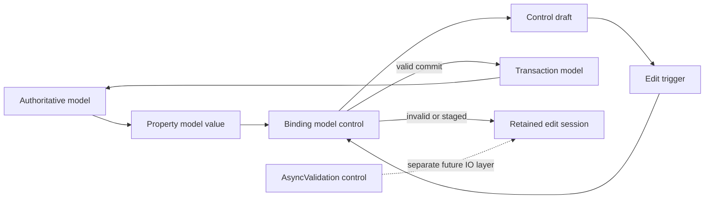

# Property and binding API

Status: implemented pure Core layer

Toolchain: GHC 9.10.3, `base-4.20.2.0`, `generic-lens`

## Purpose

UIH applications keep authoritative state in ordinary immutable Haskell
records. `Property` gives a field a typed focus and stable UIH identity;
`Binding` adds the pure editing protocol needed by controls. Together they
replace repetitive record updates without making application authors learn a
general optics library.

This is useful now because the existing controls and AppKit runtime already
produce edits, transactions, dirty-state changes, and undo metadata. The layer
now removes reducer boilerplate, makes touched state inspectable, and provides
one reusable place for formatting and validation. It does not depend on the
future opaque `View` combinator API.

## Layering and ownership



There is one authority for each value:

- `Property model value` addresses durable application state.
- A control draft is temporary edit-session state. It may be invalid and is
  therefore not forced into the authoritative model.
- `Binding model control` is a pure protocol between those two states.
- Runtime-owned presentation state will use a distinct `ElementProperty` or
  `StateSource` API. It is not represented as a model lens.
- Asynchronous validation remains visibly impure and is not a binding option.

## Properties

### Ordinary checked paths

Models derive `Generic`, then define one root:

```haskell
{-# LANGUAGE DeriveGeneric #-}
{-# LANGUAGE DerivingStrategies #-}
{-# LANGUAGE OverloadedRecordDot #-}

import GHC.Generics (Generic)
import UIH.Property

data Document = Document
  { title :: Text
  , dirty :: Bool
  }
  deriving stock (Generic)

data Model = Model
  { document :: Document
  }
  deriving stock (Generic)

properties :: Path Model Model
properties = rootPath
```

`properties.document.title` is now a statically checked path. Each record-dot
segment contributes both its generic lens and its name, so it carries the
derived `PropertyId "document.title"`. A missing or wrongly typed field fails
at compile time. `propertyId properties.document.title` exposes that identity
without first converting the path into an explicit `Property`.

The beginner-facing vocabulary is deliberately small:

```haskell
get properties.document.title model

properties.document.title .= "New title"  -- Action Model

modify properties.document.dirty not      -- Action Model
```

Assignment creates an `Action`; it does not mutate the model. Interpret it
with `applyAction` in tests, combine it with `batchActions`, or wrap it with
`transactionFromAction` in a reducer. When that transaction also launches an
effect, `transactionFromActionWithEffects` retains the same property metadata
alongside its explicit effect list.

### Explicit lens interoperability

Experienced users may wrap any compatible van Laarhoven lens:

```haskell
documentTitle :: Property Model Text
documentTitle =
  fromLens (PropertyId "document.title") (#document . #title)
```

UIH exposes its minimal `Lens'` representation and does not require the full
`lens` package. Lenses from `lens`, `generic-lens`, and handwritten lenses are
representation-compatible.

Explicit properties compose while retaining qualified identity:

```haskell
documentProperty :: Property Model Document
documentProperty = property (PropertyId "document") #document

titleProperty :: Property Document Text
titleProperty = property (PropertyId "title") #title

documentTitle = documentProperty >. titleProperty
```

The dotted path is preferred for ordinary records because the focus and ID
cannot drift after a field rename. Explicit IDs remain useful for non-record
focus and deliberately stable external identities.

### Inspectable actions

Every property update records the properties it touches:

```haskell
actionDescription  rename
-- "Set document.title"

actionPropertyIds rename
-- [PropertyId "document.title"]
```

`batchActions` unions this metadata and applies its actions in list order.
The metadata supports diagnostics and future undo optimization; it does not
claim that an arbitrary action can be serialized or inverted.

### Total and optional focus

`Property` is total: it focuses exactly one value. Selection-dependent or
otherwise partial focus uses `OptionalProperty`:

```haskell
selectedTitle :: OptionalProperty Model Text
selectedTitle =
  optionalProperty
    (PropertyId "selection.title")
    lookupSelectedTitle
    replaceSelectedTitle
```

`getOptional`, `setOptional`, and `modifyOptional` expose absence or rejection
through `Maybe` and `Either PropertyApplyError`. Optional assignment does not
use `.=` because `Action model` has no failure channel; pretending it were
total would lose a real application state.

## Bindings

### Direct binding

`bind` is the lossless live default:

```haskell
titleBinding :: Binding Model Text
titleBinding = bind properties.document.title
```

`readBinding titleBinding model` produces the control value. A valid
`InputChanged` edit produces a transaction that assigns the property.

Real edits often have policy:

```haskell
titleBinding =
  bindWith
    properties.document.title
    [ validateWith nonblank
    , alsoWrite (const (properties.document.dirty .= True))
    , commitPolicy Live
    , undoPolicy (Coalesce (UndoGroup "document-title"))
    , syncPolicy DetectConcurrentChange
    , labelTransaction "Rename document"
    ]
```

The options mean:

| Option | Meaning |
|---|---|
| `writeWith` | Replace the authoritative write action |
| `alsoWrite` | Atomically add dirty state, status, or another derived update |
| `validateWith` | Add a pure value-only synchronous validator |
| `validateWithModel` | Add a pure cross-field/model-aware validator |
| `equivalentWith` | Define equality used for draft synchronization |
| `commitPolicy` | Select the interaction that commits |
| `undoPolicy` | Attach undo/coalescing intent to committed transactions |
| `syncPolicy` | Select external-update handling during an edit |
| `labelTransaction` | Supply a user-facing transaction description |

Binding options are typed by the hidden authoritative value. They cannot be
accidentally applied to a binding of an unrelated type.

### Formatted or differently typed controls

The authoritative and control types do not need to match. A codec keeps the
conversion explicit:

```haskell
fontSizeBinding :: Binding Model Text
fontSizeBinding =
  bindText
    properties.settings.fontSize
    (textCodec (Text.pack . show) parseInteger)
    [ validateWith inFontSizeRange
    , commitPolicy OnEnterOrBlur
    ]
```

`bindWithCodec` and `codec` are the general forms. For example, an `Int` model
property may bind to a `Double` slider without passing through `Text`.

Parse failure and validation failure preserve the exact control draft and
produce `BindingIssue` values. Invalid text therefore never has to be stored
in a valid `Int` field.

### Commit protocol

The runtime or reducer feeds a trigger to `editBinding`:

| `CommitPolicy` | Commits on |
|---|---|
| `Live` | `InputChanged` |
| `OnEnter` | `EnterPressed` |
| `OnBlur` | `FocusLost` |
| `OnEnterOrBlur` | enter or focus loss |
| `ExplicitApply` | `ApplyRequested` |

```haskell
case editBinding model InputChanged titleBinding draft of
  EditCommitted _ tx -> tx
  DraftStaged _       -> noTransaction
  DraftInvalid _ _    -> noTransaction
```

`validateBinding model binding draft` runs parsing and all synchronous
validators without constructing a transaction.

The current concrete `Control`/`UIEvent` surface can integrate `Live`
bindings directly, as the AppKit vertical example does. Staged policies need
the future retained edit-session adapter to hold drafts and generate enter,
blur, and apply triggers; the pure protocol is implemented now, but that
native adapter is not yet claimed as complete.

### Controlled escape hatch

When state cannot usefully be exposed as a property, callback-style ownership
remains possible:

```haskell
controlled currentValue (\next -> domainAction next)
```

This retains binding validation and transaction behavior, but has no
`PropertyId`. Prefer a property for ordinary model state because it provides
composition and touched-property metadata.

## External updates and draft conflicts

At edit start, capture an opaque baseline:

```haskell
baseline = captureDraftBaseline binding modelAtFocus
```

When authoritative state changes, reconcile the original model value, current
local draft, and new model value:

```haskell
reconcileDraft baseline latestModel localDraft
```

Policies are precise:

| Policy | Authoritative changed, local pristine | Both changed |
|---|---|---|
| `RefreshIfPristine` | refresh | preserve local |
| `PreserveLocalDraft` | preserve local | preserve local |
| `DetectConcurrentChange` | refresh | return `BindingConflict` |

If authoritative state did not change, all policies preserve the local draft.
If local and authoritative edits converge on an equivalent value, all policies
also preserve the exact local representation without reporting a conflict.
Live bindings default to `RefreshIfPristine`; staged bindings default to
`DetectConcurrentChange`.

## Pure/impure boundary

`UIH.Property` and `UIH.Binding` contain no `IO`. Parsing, synchronous
validation, reconciliation, action construction, and transaction construction
are deterministic and headless-testable.

Network, filesystem, service, and delayed validation will live in
`UIH.Validation.Async`. That API must expose its `IO` runner, cancellation,
revision/stale-result handling, and pending-commit policy in its types. It is
not required to use the property API or live bindings today.

## Current implementation boundary

Implemented now:

- total named properties and generic dotted paths;
- explicit lens interoperability and property composition;
- inspectable assignment, modification, batching, and transaction wrapping;
- explicit optional properties;
- direct, controlled, text-codec, and general-codec bindings;
- pure parsing, value and model-aware synchronous validation;
- commit, undo, transaction-label, and external-sync policies;
- opaque baselines and three-way draft reconciliation;
- Core tests and a live AppKit example integration.

Still runtime work:

- retained invalid/staged drafts and validation presentation on native peers;
- enter, blur, explicit-apply, and IME-aware edit-session dispatch;
- the complete undo interpreter;
- separate asynchronous validation/task execution;
- `ElementProperty`/`StateSource` integration for runtime-owned UI state;
- direct `Binding` arguments on the future opaque control-combinator API.

These are integration layers around the implemented pure semantics, not a
reason to postpone using properties and live bindings in application code.

The text-editor example also validates the intended interim treatment of
dynamically keyed child state. A selected `Map DocumentKey Document` entry is
not represented as a total lens. It uses `controlledWith`, creates total
`Action Document` values, then explicitly lifts them through the established
key while qualifying their property IDs. This is safe and testable today; a
future keyed-child adapter can remove the small amount of lifting boilerplate
once its missing-key policy is standardized.

## Critical design review

The initial production draft was tightened in four ways before acceptance:

1. Dotted paths derive the ID and lens together, avoiding silent identity
   drift in the common case.
2. Optional focus remains fallible instead of masquerading as `.=`.
3. Validators may inspect the model, allowing real cross-field constraints
   while remaining pure.
4. `PreserveLocalDraft` is absolute; it never refreshes merely because the
   draft still equals its baseline.

The principal trade-off is the `Generic` requirement for dotted record paths.
Applications that cannot derive `Generic` use `fromLens` or `property` and pay
the explicit-ID cost. The runtime integration is intentionally incremental so
the pure API does not smuggle retained state or `IO` into otherwise ordinary
application code.
