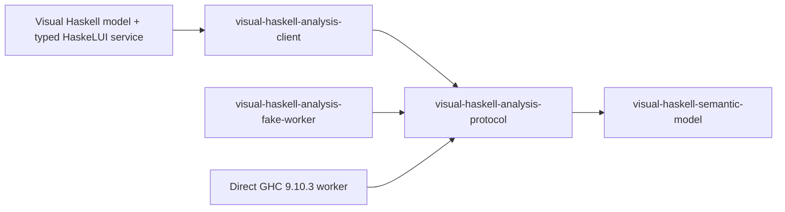

# Visual Haskell analysis spine

Status: Phase 1A, Phase 1B, and diagnostic presentation slice implemented

Date: 2026-08-07

This document describes the implemented boundary between the Visual Haskell
product and compiler-specific workers. It is narrower than the
[long-term vision](visual-haskell-vision.md): current diagnostic overlays,
Problems UI, and keyed navigation are live; declaration presentation and
position queries remain the next Phase 2 work.

## 1. Dependency direction



The semantic and protocol packages import neither HaskeLUI nor GHC. Compiler
workers translate private compiler values into this stable domain. The UI
process receives ordinary Haskell values and remains alive if a worker exits.

## 2. Semantic model

`VisualHaskell.Semantic` provides:

- Stable `WorkspaceId`, `SessionId`, `DocumentId`, declaration, diagnostic,
  and type identifiers.
- `DocumentSnapshot`, carrying path, monotonically increasing text revision,
  content hash, complete text, and line-ending policy.
- `AnalysisSnapshot`, carrying the workspace generation, worker session,
  document revision/hash, completeness/freshness, diagnostics, declarations,
  and a normalized type table.
- `RevisionedSourceRange`, which prevents a range from silently escaping the
  document revision that gave it meaning.
- A precomputed `CoordinateIndex` for exact conversion among normalized GHC
  display columns, UTF-8 byte columns, Unicode scalar columns, and UTF-16 code
  units.

All public positions are zero-based. A GHC worker must subtract GHC's
one-based line/column origin before constructing a `GhcColumn` position. Tabs
advance to eight-column display stops. Conversions reject negative positions,
missing lines, columns inside a multi-unit character, mixed coordinate spaces,
stale revisions, and reversed ranges.

The current `contentHash` is stable FNV-1a over UTF-8. It is a cheap stale-data
guard paired with the monotonic revision, not a security primitive or a
content-addressed storage identity.

## 3. Protocol and framing

Every message is a `ProtocolEnvelope payload` with protocol version and
optional request/workspace/session/document correlation plus required workspace
generation. V1 uses explicit hand-written JSON rather than generic-derived
constructor encodings, so Haskell refactoring cannot accidentally change the
wire format.

The transport is:

```text
4-byte unsigned big-endian JSON length | UTF-8 JSON payload
```

The default maximum is 16 MiB. An oversized announced length is rejected
before payload allocation. The negotiated outbound maximum is the smaller of
the client's configured bound and the worker's advertised bound. Stdout is
protocol-only; stderr is delivered as generation-tagged log events.

Handshake negotiation requires protocol-major compatibility and a nonzero
worker frame bound. Known capabilities use typed constructors. Unknown names
round-trip as `UnsupportedCapability`, allowing compatible minor-version
extension without pretending the feature is understood.

## 4. Supervised client API

The process API is intentionally small:

```haskell
startAnalysisClient
  :: WorkerLaunch
  -> ProtocolEnvelope ClientMessage
  -> (AnalysisClientEvent -> IO ())
  -> IO AnalysisClient

sendAnalysisMessage  :: AnalysisClient -> ProtocolEnvelope ClientMessage -> IO ()
restartAnalysisWorker :: AnalysisClient -> IO ()
stopAnalysisClient    :: AnalysisClient -> IO ()
waitAnalysisClient    :: AnalysisClient -> IO ()
```

`WorkerLaunch` declares the executable, arguments, working directory,
environment override, handshake timeout, restart limit, and local frame bound.
`AnalysisClientEvent` reports starting/ready/restarting/stopped lifecycle,
protocol messages, stderr logs, protocol failures, and observed process exits.
Every worker-originated event carries a `WorkerGeneration`.

The callback is the transport-to-application seam. The production adapter
translates each event into a HaskeLUI `ExternalEvent`, so the pure editor model
is changed only by the serialized runtime inbox and on the backend's UI thread.

## 5. Authoritative replay

The client retains desired state, not a transcript:

```text
latest OpenWorkspace and selected component
latest full snapshot for each open DocumentId
latest AnalyzeDocument intent for each open document
```

An update replaces the retained open snapshot; close removes both the snapshot
and analysis intent; opening another workspace clears the preceding set. On
restart, replay is ordered workspace, component, documents, then analysis
intents.

Replay and live sends share an atomic monotonic sequence watermark. Commands
already represented by the replay snapshot are skipped when their queued copy
is later encountered, while commands created after the snapshot are still
sent. Replayed messages clear old request and session identities: a new worker
owns a new session, even though workspace/document identity and revision remain
stable.

The stdout reader, stderr reader, and process watcher start before replay. This
prevents a worker producing responses during a large replay from filling its
stdout pipe while the client is blocked writing snapshots.

## 6. Product service and acceptance

Worker generation is necessary but insufficient for accepting semantic data.
`VisualHaskell.Analysis.Service` supplies the product-owned typed boundary:

```haskell
analysisService
  :: AnalysisConfiguration
  -> (AnalysisServiceEvent -> ExternalEvent model)
  -> (Service model, ServiceEndpoint AnalysisCommand)
```

`AnalysisCommand` describes workspace configuration, component selection,
document upsert/close, analysis, configuration reload, and explicit worker
restart in semantic types. Only this adapter constructs wire envelopes. Its
bounded queue replaces pending snapshots and analysis requests per document.

The Visual Haskell model accepts a result only when all of these still match:

```text
runtime service generation
worker generation
workspace generation
active component/session
document identity
text revision
content hash
```

Cancellation improves efficiency but never establishes correctness. A late
result is harmless because the pure reducer rejects mismatched identity.

Opening another project increments `WorkspaceGeneration` and clears the
selected component and old snapshots. An explicit Open Folder action grants
trust and configures analysis. On restart, trusted mode is restored only when
the workspace `.vihs` preference and user-owned trust registry both agree.
Otherwise the workspace remains text-only until the user invokes the trust
command. Full snapshots for all open Haskell documents remain authoritative in
the worker, while interactive requests are debounced and target the active
document. A component-scoped persistent GHC session uses its retained module
graph to invalidate the changed target and affected dependents.

## 7. Direct GHC 9.10.3 worker

`vh/workers/ghc-9.10` uses `hie-bios` 0.18 to load explicit or implicit
cradles. The repository's checked-in multi-component `hie.yaml` maps source
trees to exact Stack targets, avoiding ambiguous executable `Main` selection.
The worker rejects untrusted workspaces and any compiler other than GHC 9.10.3.

All direct compiler imports are isolated under
`VisualHaskell.Analysis.Ghc910.Compat`. The worker starts one `runGhc` engine
for the selected component, initializes `hie-bios`/GHC once, and keeps the
engine alive until workspace/configuration replacement or process shutdown.
Every analysis sets GHC targets for all open documents and uses `targetContents`
for authoritative in-memory text. A path/revision/hash retains its prior target
timestamp; a changed version receives a new timestamp. This lets GHC reuse its
module graph and parsed/typechecked cache while still invalidating edited
modules and dependents. GHC diagnostics are intercepted by one session-level
log hook whose current capture is switched per request; stdout remains
protocol-only. Top-level declarations and GHC types are translated to stable
semantic DTOs before they cross the process boundary.

The worker serializes analysis within its GHC session and does not yet
advertise in-progress cancellation. That is an explicit current limit, not an
implied guarantee: correctness still comes from acceptance identities.

## 8. Verification

The implemented tests cover:

- Tabs, CRLF, emoji, Unicode, UTF-8 and UTF-16 boundaries, invalid mid-unit
  columns, stale revisions, and JSON snapshot round trips.
- Semantic JSON fixtures, forward-compatible capabilities, bounded frame round
  trips, truncated input, and oversized input before allocation.
- A real fake-worker process that exits once during analysis. The client
  automatically starts the next generation, replays the newest document (not
  an older queued update), receives the expected result, and emits no old
  generation message after the replacement worker is ready.
- Real `hie-bios` discovery of this repository's Stack component through the
  checked-in multi-cradle mapping. This is a post-build check because a Stack
  cradle starts `stack repl`, which must not wait on an enclosing `stack test`
  process that still owns the build lock.
- Two dependent modules whose on-disk types disagree but whose two unsaved
  snapshots typecheck, plus a broken unsaved revision whose GHC diagnostic is
  bound to that exact revision and a corrected revision checked in the same
  live GHC session. The fixture enforces a one-second warm-edit budget.
- The real GHC worker protocol across two revisions, component/session events,
  normalized declarations and types, and a forced child-process crash. The
  replacement generation replays workspace, buffers, and analysis intent,
  creates one replacement session, and then reuses it for the next revision.
- A full Visual Haskell/HaskeLUI runtime fixture that opens a workspace and
  observes a strictly accepted direct-GHC result in the rendered status area.

Run the focused verification from the repository root:

```console
stack test visual-haskell-semantic-model \
  visual-haskell-analysis-protocol \
  visual-haskell-analysis-client \
  visual-haskell-analysis-ghc910 \
  visual-haskell:vh-analysis-service-test --fast --jobs 1

tests/visual-haskell/validate-analysis-self-host.sh
```

## 9. Native semantic editor slices

Implemented diagnostics slice:

1. Present accepted diagnostics as a generic revision-bound colored-underline
   text layer plus a Problems inspector list.
2. Selecting a problem activates the owning tab and sends one keyed,
   revision-bound reveal/select request; normal native caret motion remains
   backend-local.
3. Suppress stale document/revision/hash/freshness/range projections entirely.

Next slice:

1. Surface top-level declarations and normalized signatures in the inspector
   and provide source navigation using the existing stable ranges.
2. Add typed hover and definition-at-position protocol messages with concrete
   GHC fixtures and exact stale-result acceptance tests.
3. Expose discovered components and explicit selection when more than one
   component owns a file.
4. Watch cradle/configuration dependencies and request explicit reloads for
   trusted workspaces.

Cancellation, concurrent scheduling, incremental invalidation, HIE indexing,
and cross-workspace caches remain later performance/indexing work. They should
be added only after profiling the current correct full-snapshot path.
