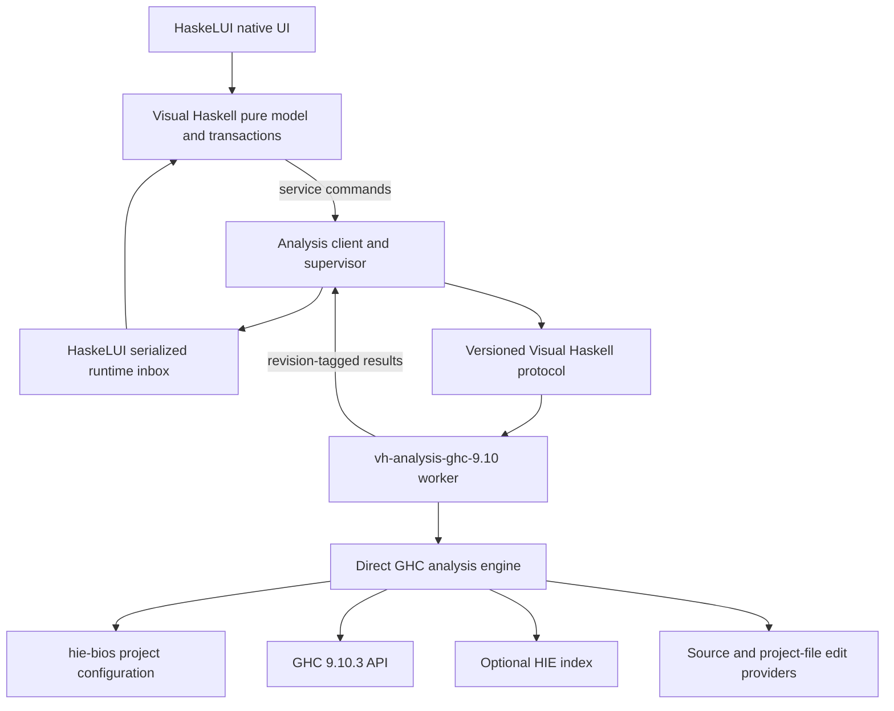

# Visual Haskell long-term product and analysis vision

Status: proposed roadmap

Date: 2026-08-06

Audience: Visual Haskell contributors, HaskeLUI runtime contributors, compiler
integration authors, and product designers

## 1. Product vision

Visual Haskell will be a native, source-first Haskell development environment
that combines:

- A capable conventional code editor
- Project-aware compiler diagnostics and navigation
- Structured explanations of types, declarations, constraints, and effects
- Visual semantic views that remain connected to source
- Carefully bounded source transformations with preview and undo
- Eventually, round-trippable visual authoring for explicitly supported
  Haskell subsets

The product is not an Electron shell around an existing web editor. HaskeLUI
owns native windows, controls, text interaction, layout, commands,
accessibility, and platform integration. Haskell intelligence is provided by a
separate native Haskell worker built directly on the GHC API.

Source text remains authoritative. Arbitrary Haskell can always be inspected
and visualized, but it is not automatically promised to be editable through a
graph. Visual editing is offered only where the product has a tested,
source-preserving round-trip contract.

## 2. Accepted architectural direction

The initial implementation will:

1. Use the `ghc` package directly for parsing, renaming, typechecking, module
   information, types, HIE ASTs, and compiler diagnostics.
2. Use `hie-bios` to discover component-specific compiler flags and project
   configuration.
3. Not depend initially on `ghcide`, HLS, LSP, `hls-graph`, or
   `hls-plugin-api`.
4. Run compiler integration in a separate GHC-version-specific worker process.
5. Communicate through a stable Visual Haskell protocol containing no raw GHC
   values.
6. Support GHC 9.10.3 first and add other compiler workers only after the
   protocol and product behavior stabilize.
7. Keep the existing pure lexical highlighter as an immediate fallback.
8. Apply all worker-generated changes through normal revision-checked editor
   transactions. The worker never writes source files.
9. Keep portable UI/workspace state in `.vihs` and rebuildable compiler data in
   a user cache outside the workspace.
10. Use the implemented generic HaskeLUI asynchronous runtime before
    integrating the compiler worker.

The required runtime design is specified in
[HaskeLUI services, tasks, and external events](services-tasks-external-events.md).

## 3. Product boundaries

### 3.1 HaskeLUI owns

- Application and window lifecycle
- Native shell, controls, text views, menus, panes, tabs, and status surfaces
- Rendering and layout
- Keyboard, pointer, focus, accessibility, and IME behavior
- Pure actions, properties, bindings, and transactions
- Generic tasks, services, subscriptions, cancellation, and external events
- Platform services such as native file/folder selection

HaskeLUI must not contain GHC, Cabal, Stack, Haskell syntax, or compiler-worker
types.

### 3.2 Visual Haskell owns

- Documents, workspaces, project/component selection, and editor policy
- The analysis protocol and worker supervisor
- Haskell diagnostics and semantic presentation
- Stable semantic domain types
- Compiler-version worker selection
- Haskell-specific graphs, inspectors, transformations, and project-file tools
- Workspace trust policy
- Analysis caches and product diagnostics

### 3.3 GHC owns

- Haskell syntax and extension interpretation
- Name resolution and fixity
- Types, constraints, classes, instances, and kinds
- Module interfaces and exports
- Type compatibility and expression checking
- Desugaring and Core where needed
- Compiler diagnostics

Visual Haskell must not implement a competing Haskell parser, resolver, or type
checker.

## 4. System architecture



The UI process never links a project-specific `ghc` library. It can remain
running when a worker crashes, is replaced, or uses a different compiler
version.

## 5. Planned package and folder structure

No package split is required before implementation begins, but the long-term
ownership should be:

```text
vh/
  app/                              Visual Haskell executable
  src/VisualHaskell/                Product UI and model

  packages/
    analysis-protocol/              Versioned wire DTOs
    semantic-model/                 Stable product semantic types
    analysis-client/                Supervision, transport, routing
    project-files/                  Cabal, Stack, and Hpack adapters

  workers/
    ghc-9.10/                       Direct GHC 9.10 worker

  test-fixtures/
    projects/                       Compiler/project compatibility fixtures
    protocol/                       Golden protocol messages
```

Suggested package identities are:

```text
visual-haskell
visual-haskell-analysis-protocol
visual-haskell-semantic-model
visual-haskell-analysis-client
visual-haskell-project-files
visual-haskell-analysis-ghc-910
```

The protocol and semantic-model packages depend only on stable ordinary
packages such as `base`, `containers`, `text`, and serialization libraries.
They must not import `GHC`, `Development.IDE`, `HIE.Bios`, or native UI modules.

## 6. Protocol design

### 6.1 Transport

V1 uses length-prefixed JSON over worker stdin/stdout:

- Human-readable and easy to capture in fixtures
- Cross-platform without socket or named-pipe setup
- Naturally tied to process lifetime
- Replaceable later with CBOR or another binary codec

Stdout is protocol-only. Human logs and crash context go to stderr. The client
must terminate a worker that emits malformed or oversized protocol frames.

### 6.2 Envelope

Every request, response, and notification carries a common envelope:

```haskell
data ProtocolEnvelope payload = ProtocolEnvelope
  { protocolVersion     :: !ProtocolVersion
  , protocolRequestId   :: !(Maybe RequestId)
  , protocolWorkspace   :: !(Maybe WorkspaceId)
  , protocolGeneration  :: !WorkspaceGeneration
  , protocolSession     :: !(Maybe SessionId)
  , protocolDocument    :: !(Maybe DocumentId)
  , protocolRevision    :: !(Maybe TextRevision)
  , protocolContentHash :: !(Maybe ContentHash)
  , protocolPayload     :: !payload
  }
```

The worker does not infer identity from file paths alone. Paths are attributes
of documents and workspace roots, not protocol correlation keys.

### 6.3 Handshake and capabilities

The worker begins with:

```text
ClientHello
  protocol major/minor
  client version
  requested workspace root
  trust mode
  requested capabilities

WorkerHello
  accepted protocol version
  worker build/version
  exact GHC version
  supported capabilities
  maximum frame size
```

A protocol-major mismatch prevents startup. Minor versions use explicit
capability negotiation and ignore safely extensible unknown fields.

Initial capabilities include:

- Workspace loading
- Full document snapshots
- Diagnostics
- Document declarations
- Structured types
- Semantic spans
- Definition locations
- Cancellation

Future capabilities include deltas, completion, HIE references, project edits,
source transformations, composition checking, and visual graph models.

### 6.4 Initial messages

Client commands:

```text
OpenWorkspace
SelectComponent
OpenDocument
UpdateDocumentSnapshot
CloseDocument
AnalyzeDocument
QueryAtPosition
CancelRequest
ReloadConfiguration
Shutdown
```

Worker events:

```text
WorkspaceLoading
WorkspaceReady
WorkspaceFailed
ComponentDiscovered
DiagnosticsPublished
AnalysisCompleted
RequestFailed
WorkerHealth
```

Logs are not normal protocol events. Structured user-relevant failures are.

### 6.5 Ordering and stale data

The worker may finish requests out of order. The client accepts a document
result only when:

- Runtime service generation is current.
- Workspace generation is current.
- Session/component identity is current.
- Document revision and content hash match the open buffer.

Cancellation is requested for obsolete work but is never trusted for
correctness.

## 7. Direct GHC worker

### 7.1 Compatibility boundary

All imports from the `ghc` package are isolated under:

```text
VisualHaskell.Analysis.Ghc910.Compat
```

The rest of the worker uses small internal wrapper types. Even for one GHC
version, this boundary prevents compiler constructors and error representations
from spreading into project loading, scheduling, or protocol conversion.

A future GHC worker may copy or adapt this compatibility namespace without
changing client or semantic-model packages.

### 7.2 Project loading

`hie-bios` discovers:

- Build tool and cradle
- Components owning a source file
- GHC executable and library directory
- Package databases
- Source directories and targets
- Extensions and compiler flags
- CPP/preprocessor configuration
- Cradle dependencies that require reload

Visual Haskell does not independently interpret Cabal or Stack configuration to
construct GHC sessions.

Project-file parsing for display/editing is a separate feature and never
becomes the compiler-configuration authority.

### 7.3 Session identity

```haskell
data SessionIdentity = SessionIdentity
  { sessionWorkspaceGeneration :: !WorkspaceGeneration
  , sessionCompilerVersion     :: !CompilerVersion
  , sessionCradleIdentity      :: !CradleIdentity
  , sessionComponent           :: !ComponentIdentity
  , sessionFlagsHash           :: !ContentHash
  , sessionTrustMode           :: !TrustMode
  }
```

A source file may belong to multiple components. The worker reports all known
owners. Visual Haskell chooses a default and displays the active component in
the status UI. Changing it creates or selects a different session identity.

The first worker may keep one active component session. The protocol must not
assume that limitation.

### 7.4 GHC pipeline

The direct engine initially follows the high-level GHC API:

```haskell
runGhc (Just libDir) $ do
  setSessionDynFlags componentFlags
  setTargets componentTargets
  load LoadAllTargets
  summary <- getModSummary moduleName
  parsed <- parseModule summary
  checked <- typecheckModule parsed
  -- Convert parsed, renamed, typed, and module information immediately
  -- into Visual Haskell semantic values.
```

Relevant data includes:

- `ParsedModule`
- `RenamedSource`
- `TypecheckedSource`
- `ModuleInfo`
- `TyThing`, `Id`, `Name`, `Type`, `TyCon`, classes, and instances
- HIE AST data
- Module graph and interfaces
- Compiler diagnostics

Raw GHC values never cross the process boundary and are never persisted in
`.vihs`.

### 7.5 Unsaved documents

The editor buffer is authoritative for every open document. The worker owns an
overlay map:

```haskell
data DocumentSnapshot = DocumentSnapshot
  { snapshotDocumentId :: !DocumentId
  , snapshotPath       :: !FilePath
  , snapshotRevision   :: !TextRevision
  , snapshotHash       :: !ContentHash
  , snapshotText       :: !Text
  , snapshotLineEnding :: !LineEndingPolicy
  }
```

V1 sends complete snapshots. The worker supplies the snapshot to GHC through
the supported in-memory target/source mechanism selected by the GHC 9.10
spike. It must not overwrite the workspace file or require an autosave.

The spike must test imports between two simultaneously unsaved modules, not
only one dirty visible file.

### 7.6 Scheduling and invalidation

GHC session mutation is serialized per session. Requests may execute
concurrently across independent worker sessions only after profiling and
thread-safety validation.

V1 may ask GHC to reload the active component after a changed snapshot. Before
building a custom fine-grained cache, measure:

- Time to diagnostics for the visible module
- Reuse provided by the live GHC session
- Number of modules recompiled
- Memory retained by typechecked modules

If needed, the worker adds a dependency-aware dirty set:

1. Content change marks the module dirty.
2. Parse/import change invalidates the affected dependency graph.
3. Interface/type change invalidates dependents.
4. A body-only change may retain more downstream information when GHC permits.
5. Project flag/cradle change advances workspace generation and rebuilds the
   session.

Visual Haskell should not recreate all of `ghcide` speculatively. It should add
incrementality only where measurements show the direct session is inadequate.

### 7.7 Last-good semantics

The worker may retain its previous successful compiler state internally. The
client retains the last accepted stable `AnalysisSnapshot` separately from
current diagnostics.

When current source is broken:

- Current diagnostics are shown for the current revision.
- Last-good semantic information may remain available.
- Every retained semantic result is visibly marked stale.
- Source transformations and visual authoring are disabled against stale data.

Stale data must never silently appear current merely because it is useful.

## 8. Stable semantic model

### 8.1 Analysis snapshot

```haskell
data AnalysisSnapshot = AnalysisSnapshot
  { analysisWorkspaceGeneration :: !WorkspaceGeneration
  , analysisSession             :: !SessionId
  , analysisDocument            :: !DocumentId
  , analysisRevision            :: !TextRevision
  , analysisContentHash         :: !ContentHash
  , analysisCompleteness        :: !AnalysisCompleteness
  , analysisFreshness           :: !AnalysisFreshness
  , analysisDiagnostics         :: ![Diagnostic]
  , analysisSemanticSpans       :: ![SemanticSpan]
  , analysisDeclarations        :: ![Declaration]
  , analysisTypes               :: !TypeTable
  }
```

Completeness distinguishes parse-only, renamed, typechecked, indexed, and
partially failed results. Freshness distinguishes current and stale retained
data.

### 8.2 Source ranges and coordinate index

Visual Haskell needs a revision-bound coordinate index supporting:

- GHC line/column positions
- UTF-8 byte offsets
- Unicode-scalar offsets used by portable text layers
- AppKit UTF-16 ranges
- Future Windows native text ranges
- LF and CRLF
- Tabs and non-ASCII identifiers

The index stores line starts in each coordinate system and provides checked
conversions. It never converts a range without the matching document revision.

CPP, preprocessors, `LINE` pragmas, and literate Haskell may introduce source
maps. A range that cannot be mapped unambiguously is reported as approximate or
unavailable rather than guessed.

Required fixtures include emoji, combining marks, tabs, CRLF, Unicode
identifiers, CPP, and `.lhs`.

### 8.3 Symbol identity

Global symbols use:

```text
unit/package identity
module name
namespace
occurrence name
```

GHC `Unique` values are session-local and are never protocol identity.

Local binders initially receive snapshot-scoped identities containing module,
source anchor, namespace, and a local ordinal/fingerprint. They are not
promised stable across arbitrary edits. Persistent visual state anchors to
top-level declarations whenever possible.

Structural local-binder rematching is deferred until a real feature proves its
value and supplies measurable correctness criteria.

### 8.4 Structured types

The stable type model supports:

- Variables and kinds
- Constructor applications
- Function arrows and multiplicities
- Universal quantification
- Constraints
- Tuples, lists, and literals
- Type-family applications
- Visible and invisible arguments
- Explicit unknown/unsupported nodes for forward compatibility

Every exposed declaration may carry:

- Source-facing signature text
- GHC-pretty inferred text
- Canonical structured type
- Optional normalized type

The source-facing form prevents synonym expansion from destroying the user's
mental model. The canonical form supports compatibility and visualization.

## 9. UI integration

### 9.1 Immediate lexical layer

The existing pure Haskell lexer remains the first presentation layer. It is:

- Immediate
- Available before project loading
- Available in untrusted workspaces
- Independent of compiler health

### 9.2 Semantic layers

Compiler results add revision-bound layers for:

- Resolved values and functions
- Local bindings
- Types and constructors
- Classes and instances
- Record fields
- Deprecated symbols
- Warnings and errors
- Related source ranges

The theme maps semantic categories into generic HaskeLUI `TextStyle` values.
Compiler-specific categories do not enter HaskeLUI Core.

### 9.3 Diagnostics surfaces

Diagnostics appear through several projections of the same stable data:

- Editor underlines and line markers
- Hover details
- Workspace problem list
- Status summary
- Related-location navigation

Diagnostic source, severity, freshness, component, and current/stale status are
always explicit.

### 9.4 Analysis status

The UI must distinguish:

```text
Lexical only
Loading project
Analyzing current revision
Current semantic result
Current diagnostics with stale semantics
Worker restarting
Unsupported compiler
Untrusted workspace
Analysis failed
```

Silently falling back from compiler semantics to lexical highlighting would
make incorrect information difficult to recognize.

## 10. Conventional IDE features

The first direct-GHC product milestone provides:

1. Current-revision diagnostics
2. Semantic highlighting
3. Document declarations/symbol outline
4. Hovered symbol and type information
5. Go to definition within loaded components
6. Module exports and import information
7. Active component selection

Completion, rename, find references, call hierarchy, hole fits, import edits,
and code actions follow only after the base session proves responsive and
correct.

Workspace-wide references eventually use `.hie` files and `hiedb` or an
equivalent HIE index. The index is rebuildable cache data keyed by workspace,
compiler, package/component configuration, and index schema.

## 11. Visual semantic features

### 11.1 Projection classes

Every visual feature declares one of two contracts:

```text
Observation
  May visualize arbitrary supported compiler information.
  Read-only except for navigation and selection.

RoundTripProjection
  Covers a documented source subset.
  Has parse-project-edit-reparse equivalence tests.
  Supports preview, undo, and conflict rejection.
```

The product must never present an `Observation` as though arbitrary graph edits
could safely regenerate source.

### 11.2 Function nodes and ports

A function/declaration node may show:

- Quantified variables
- Constraints/capabilities
- Ordered curried arguments
- Result
- Source binder names
- Documentation
- Source location
- Surface and canonical types

Displaying `a -> b -> c` as two visible input ports is a UI projection of a
curried type, not a claim that the source denotes an uncurried two-input
function.

### 11.3 Composition checking

Visual Haskell does not implement its own Haskell unifier. The worker asks GHC
to typecheck a synthetic declaration or expression in the active module and
component context.

The stable result reports:

- Compatible or incompatible
- Instantiated variables where reliably available
- Required constraints
- Expected and actual structured types
- Human-readable GHC explanation
- Needed imports/extensions when known

Structured mismatch extraction is best effort because compiler diagnostic
internals change. The protocol always retains a stable human-readable fallback.

### 11.4 Transformer and capability visualization

Two views are distinct:

- Concrete stack: `ReaderT r (StateT s IO)` and normalized aliases
- Abstract capabilities: `(MonadReader r m, MonadState s m) => m a`

Abstract constraints must not be presented as a fabricated transformer order.
A registry describes known standard transformers, while unknown constructors
use a generic fallback.

Mapping an operation to a stack level may use selected instances, explicit
`lift` chains, occurrence types, and dictionary evidence. This is custom
analysis over GHC output, not custom typechecking.

### 11.5 Arrow diagrams

Arrow diagrams use parsed/renamed `HsCmd` and `proc` structure plus typechecked
port information. They do not derive editable source structure from Core.

The first round-trip subset is limited to explicitly tested forms such as:

- `proc`
- `-<`
- `returnA`
- Static composition
- Tupling
- `first` and `second`
- Simple conditionals

Choice, loops, recursive arrows, and dynamic `ArrowApply` remain observation
nodes until separately specified.

## 12. Source transformations

The worker returns proposed edits; it never modifies files.

```haskell
data ProposedEdit = ProposedEdit
  { editDocument    :: !DocumentId
  , editBaseRevision :: !TextRevision
  , editBaseHash    :: !ContentHash
  , editDescription :: !Text
  , editReplacements :: ![TextReplacement]
  , editValidation  :: !EditValidation
  }
```

The client:

1. Verifies revision and hash.
2. Displays a diff/semantic preview when required.
3. Rejects conflict rather than silently rebasing in V1.
4. Applies all replacements as one transaction and one undo group.
5. Reparses/reanalyzes the resulting document.

`ghc-exactprint` is introduced only for transformations that need structured
source preservation. Its version belongs in the compiler-specific worker
because it tracks GHC AST versions. `.lhs` analysis may be supported while
structural editing remains read-only.

## 13. Project-file model and editing

Compiler configuration and project-file presentation are separate concerns:

- `hie-bios` determines how a source file is compiled.
- Format-specific providers display and edit configuration.

Planned providers are:

| Format | Semantic authority | Positioned editing |
| --- | --- | --- |
| `.cabal` | `Cabal-syntax` | Cabal positioned field tree |
| `cabal.project*` | Cabal fields plus `cabal` validation | Supported field edits |
| `stack.yaml*` | Stack CLI plus YAML decoding | Marked YAML edits |
| `package.yaml` | Hpack | Marked YAML edits |

Rules:

1. Do not write custom Cabal or YAML parsers.
2. Read/display support may be broader than structured editing support.
3. Modify only a narrow field/node range; do not pretty-print the whole file.
4. Reparse and invoke the authoritative tool after every proposed edit.
5. Preview and apply through normal editor transactions.
6. Detect source of truth. If Hpack generated a Cabal file, edit
   `package.yaml`, not the generated file.
7. Unsupported anchors, duplicate keys, condition structures, or formatting
   return a clear unsupported-edit result and open the text editor.
8. Avoid linking license-incompatible parser libraries without a separate
   distribution decision; invoking the installed `cabal` tool remains an
   option.

Project-file editing is not required for the first semantic milestone.

## 14. Workspace trust and execution safety

Trust is required before running project-controlled tooling.

Potentially executable project behavior includes:

- Custom `hie-bios` cradles
- Cabal/Stack commands
- Template Haskell
- Compiler plugins
- CPP and preprocessors
- Custom setup logic

A worker process gives crash and memory isolation, not a security sandbox.

Trust modes are:

```haskell
data TrustMode
  = Untrusted
  | Trusted
```

Untrusted mode provides:

- File tree and ordinary text editing
- Pure lexical highlighting
- No project commands
- No custom cradle
- No compiler plugins or Template Haskell execution
- Clear action to review and trust the workspace

Trusted mode permits configured project analysis and records invoked tools in
diagnostic logs. Future OS-specific worker sandboxing may further restrict
filesystem, network, and subprocess access, but it does not replace the trust
decision.

Trust is stored in a per-user product registry keyed by canonical workspace
identity, not in the workspace-controlled `.vihs` file.

## 15. Cache and persistence policy

`.vihs` stores portable product state:

- Open documents and active tab
- Pane and sidebar state
- Expanded project folders
- Selected semantic view
- Component selection where safely portable
- Visual-layout state referring to stable declarations

The user cache stores rebuildable data:

- HIE index
- Parsed module metadata
- Package documentation indexes
- Worker download/install metadata
- Performance profiles and logs under retention policy

Cache identity includes workspace, GHC version, component/flags fingerprint,
protocol/schema version, and relevant file hashes. Cache corruption never
prevents opening the workspace; it causes eviction and rebuilding.

## 16. Worker lifecycle and compiler versions

V1 bundles one worker:

```text
vh-analysis-ghc-9.10.3
```

One worker process serves one workspace and compiler version, with one or more
component sessions inside it. This maximizes failure isolation and prevents
project state from leaking between workspaces.

Later worker selection performs:

1. Detect project compiler through trusted project tooling.
2. Find an exact compatible installed worker.
3. Offer a signed supported worker download when absent.
4. Verify signature, protocol, and exact compiler compatibility.
5. Start and negotiate capabilities.

Unsupported compilers leave the editor fully usable in lexical mode.

Workers have configurable memory and restart limits. Repeated failure opens a
visible degraded state rather than an infinite restart loop.

## 17. Performance strategy

The first rule is to measure direct GHC before rebuilding `ghcide`.

Instrumentation records:

- Project/cradle discovery time
- Cold and warm session load
- Visible-document diagnostic latency
- Modules parsed/typechecked per revision
- Queue/debounce delay
- Protocol serialization volume
- Worker resident memory
- Retained typechecked-module count
- HIE indexing time and size
- Worker restart time

Initial policies:

- Debounce semantic analysis while lexical highlighting remains immediate.
- Prioritize visible documents and explicit queries.
- Coalesce pending snapshots by document, retaining the newest revision.
- Serialize mutation within one GHC session.
- Use full snapshots for the first milestone.
- Add edit deltas and a rope/piece-table document representation before
  claiming large-file production performance.
- Bound cached modules and evict inactive sessions under memory pressure.

No fixed latency target is accepted until the GHC 9.10 spike establishes
realistic baselines on small, medium, and large fixture projects.

## 18. Testing strategy

### 18.1 Protocol tests

- Golden encoding/decoding
- Unknown optional fields
- Major-version rejection
- Capability negotiation
- Malformed and oversized frames
- Out-of-order responses
- Cancellation races
- Worker exit during a request

### 18.2 Compiler fixtures

Fixture projects cover:

- Stack, Cabal, and Hpack workspaces
- Multiple packages and components
- One file owned by several components
- Two simultaneously unsaved dependent modules
- Warnings, parse failures, type failures, and missing imports
- Unicode identifiers, emoji, combining characters, CRLF, and tabs
- CPP, `LINE` pragmas, preprocessors, and generated modules
- Trusted Template Haskell and compiler plugins
- Untrusted denial of executable project features
- `.lhs` analysis
- Cycles and boot files where supported

### 18.3 Semantic golden tests

Stable protocol/domain values are golden-tested rather than raw GHC `Show`
output. Each supported GHC worker owns its compiler-specific expected fixtures.

### 18.4 Runtime integration tests

- New revisions cancel/obsolete old analysis.
- Old service generations cannot update the model after restart.
- Worker events enter through the HaskeLUI inbox.
- AppKit updates remain on the main thread.
- Closing a workspace lifetime rejects racing results.
- Restart preserves the editor model and resends authoritative snapshots.

### 18.5 Self-hosting fixture

The HaskeLUI/Visual Haskell repository itself is a mandatory integration
fixture. The worker must load the real Stack workspace, analyze an unsaved
Visual Haskell module, and return correctly mapped diagnostics and declaration
types.

## 19. Delivery plan and gates

### Phase 0: Generic runtime foundation

Implemented in
[HaskeLUI services, tasks, and external events](services-tasks-external-events.md).

Gate:

- The runtime suite proves typed service emission, restart, bounded command
  coalescing, stale task rejection, subscription teardown, and deterministic
  batch ordering. The AppKit suite proves a real background task and service
  both re-enter the current model on the main queue and release all native
  resources.

### Phase 1: Direct-GHC feasibility worker

- Create protocol, semantic-model, client, and GHC 9.10 worker packages.
- Load the current repository through `hie-bios`.
- Send full unsaved snapshots.
- Return diagnostics, declarations, and structured types.
- Implement forced-crash restart and snapshot replay.

Gate:

- A supervised GHC 9.10.3 worker loads a real Stack workspace, analyzes two
  dependent unsaved modules, maps Unicode ranges correctly, discards obsolete
  results, and recovers after a forced crash.

### Phase 2: Native semantic editor

- Add semantic highlighting, hover, definition, outline, analysis status, and
  component selection.
- Preserve lexical fallback and explicit stale-state presentation.
- Add project-configuration reload and trusted file watching.

Gate:

- Visual Haskell can be used for ordinary editing without HLS, and native tests
  prove that semantic layers never change characters, selection, IME state, or
  undo history.

### Phase 3: Incrementality and workspace index

- Profile direct GHC reload behavior.
- Add only the invalidation/cache layers measurements require.
- Add HIE generation/indexing and workspace references.
- Introduce document deltas and efficient text storage.

Gate:

- Medium fixture projects remain responsive during continuous edits, memory is
  bounded, and cross-module references survive restart/reindex correctly.

### Phase 4: Read-only semantic workspaces

- Add declaration/type browser.
- Add function nodes and ports.
- Add module/dependency/call projections.
- Add transformer and capability observations.
- Add GHC-backed compatibility queries.

Gate:

- Every visual element identifies source and freshness, and no observation
  implies unsupported editability.

### Phase 5: Safe transformations

- Add previewable source edits.
- Integrate version-matched `ghc-exactprint` for selected transformations.
- Add transactional application, undo grouping, and conflict rejection.
- Add conservative project-file providers.

Gate:

- Parse-edit-print-reparse fixtures preserve unrelated comments and formatting,
  stale edits never apply, and every accepted change is one undoable editor
  transaction.

### Phase 6: Constrained visual authoring

- Define a typed pipeline/composition subset.
- Add restricted Arrow observation, then round-trip authoring.
- Persist visual layout separately from semantic/source identity.

Gate:

- Every supported graphical edit has bidirectional equivalence fixtures and a
  transparent source preview. Unsupported Haskell remains read-only.

### Phase 7: Compiler matrix and distribution

- Add another GHC-version worker.
- Implement signed worker discovery/install/update.
- Prove one UI client can switch between compiler workers without product model
  changes.

Gate:

- Adding a worker requires no HaskeLUI or stable semantic protocol changes and
  has isolated compiler-specific golden tests.

## 20. Explicit non-goals for early releases

- Reimplementing HLS feature-for-feature
- Arbitrary Haskell graph editing
- A custom Haskell parser or typechecker
- Concurrent support for many GHC versions before one is reliable
- Executing untrusted Template Haskell or project scripts
- Whole-file pretty-printing for targeted edits
- Treating normalized types as the only user-facing form
- Persisting raw GHC identities or ASTs
- Hiding compiler failure behind apparently current lexical presentation

## 21. Resolved decisions

1. Direct GHC is the first analysis engine.
2. `hie-bios` remains the project-session configuration provider.
3. `ghcide`, HLS, and LSP are absent from V1 dependencies and runtime.
4. The worker is a separate executable even while only GHC 9.10.3 is supported.
5. Protocol and semantic domain types are separate packages/concepts.
6. Full snapshots precede incremental deltas.
7. Source is authoritative; arbitrary visualizations are observations.
8. All edits are revision/hash checked, previewable, and applied by the UI.
9. Workspace trust precedes project-controlled execution.
10. `.vihs` remains portable UI state, not a compiler cache.
11. The generic HaskeLUI runtime is Phase 0 and contains no Haskell-specific
    request or result constructors.

## 22. Remaining open questions

These are intentionally explicit and include current recommendations.

### 22.1 Unsaved-source mechanism in GHC 9.10

The GHC API offers in-memory target/source facilities, while preprocessors and
multi-module overlays complicate their use. The Phase 1 spike must compare the
supported target-content route with a worker-private overlay/file-hook route.
The recommendation is to use the narrowest public GHC API that supports two
dependent unsaved modules and only introduce lower-level hooks when a fixture
requires them.

### 22.2 Component-session policy

Keeping every component live improves switching but can multiply memory. One
session minimizes memory but makes component switches expensive. Begin with one
active session plus recently used bounded retention; measure memory and switch
latency before choosing a larger pool.

### 22.3 Direct-GHC incrementality threshold

We do not yet know whether GHC's live session reuse is sufficient for target
projects. Define fixture baselines before implementing custom rule graphs. If
visible diagnostics exceed acceptable measured latency or reloads touch
unrelated modules, add dependency-aware caching. If that work begins to
recreate most of `ghcide`, reassess using it behind the unchanged engine
boundary.

### 22.4 Protocol encoding after JSON

JSON is ideal for the first protocol but expensive for large text and semantic
tables. Instrument frame size and encode/decode time. Move large payloads to
CBOR, shared-memory blobs, or a negotiated binary channel only after a measured
bottleneck. Protocol meaning must remain independent of encoding.

### 22.5 Worker acquisition

Bundling one worker is clear; supporting many compilers raises storage,
signature, update, rollback, and offline questions. Do not design a public
marketplace yet. First prove a second worker can coexist and negotiate against
the same client, then specify signed distribution.

### 22.6 Visual round-trip boundary

Pure composition, point-free expressions, `do`, and Arrow notation have
different source semantics. The first editable subset should be selected by a
concrete user workflow and a small grammar that can be proven bidirectional.
The recommendation is a typed pipeline/composition declaration before general
Arrow editing; read-only Arrow diagrams may arrive earlier.

### 22.7 Project-file editing scope

Structured project editors are attractive but can consume significant effort
without improving the core semantic experience. Implement read-only component
and dependency presentation first. Add narrow edit actions such as adding a
dependency only after source-of-truth detection and format-preservation
fixtures pass.

## 23. First concrete experiment

The first compiler milestone is deliberately narrow:

> Start a supervised GHC 9.10.3 worker, load the HaskeLUI workspace through
> `hie-bios`, analyze two dependent unsaved document revisions, and return
> correctly mapped diagnostics, declarations, and structured types. Then force
> the worker to crash, restart it, replay authoritative snapshots, and prove
> that no stale pre-crash event reaches the current model.

Success validates the process boundary, protocol, runtime service substrate,
direct GHC approach, source overlays, Unicode coordinates, revision rules, and
restart model in one vertical slice.

## 24. External technical references

- [GHC API documentation](https://downloads.haskell.org/~ghc/9.10.2/docs/libraries/ghc-9.10.2-96d4/GHC.html)
- [`hie-bios`](https://hackage.haskell.org/package/hie-bios)
- [`hiedb`](https://hackage.haskell.org/package/hiedb)
- [`ghc-exactprint`](https://hackage.haskell.org/package/ghc-exactprint)
- [`Cabal-syntax`](https://hackage.haskell.org/package/Cabal-syntax)
- [`hpack`](https://hackage.haskell.org/package/hpack)
